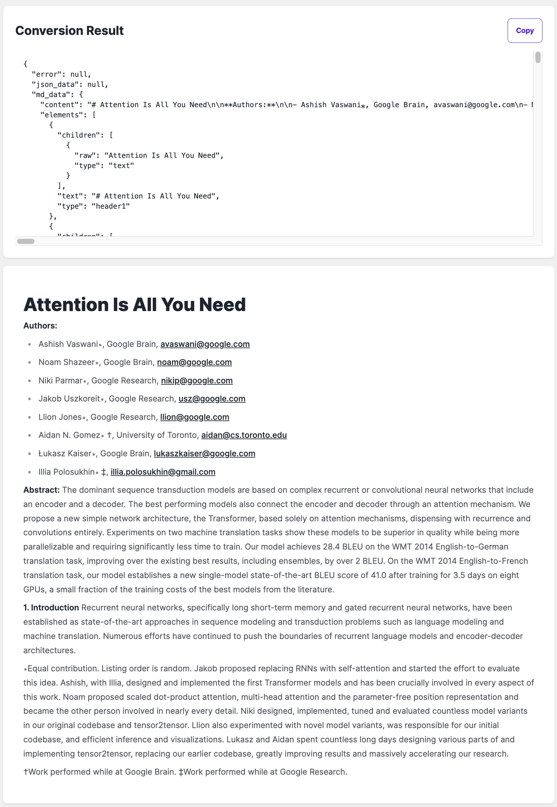
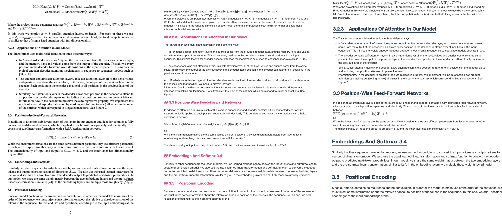

# E2M (Everything to Markdown)

<p align="center">
    <a href="https://github.com/Jing-yilin/E2M">
        
    </a>
</p>

<p align="center">
    <a href="https://github.com/Jing-yilin/E2M">
        
    </a>
    <a href="https://github.com/Jing-yilin/E2M/tags/v1.0.5">
        
    </a>
    <a href="https://hub.docker.com/r/jingyilin/e2m/tags">
        
    </a>
</p>

<div align="center">
  <a href="./README.md"></a>
  <a href="./README_CN.md"></a>
</div>

- [E2M (Everything to Markdown)](#e2m-everything-to-markdown)
  - [🌟Introduction](#introduction)
    - [🌐Web](#web)
    - [📸Demo](#demo)
    - [📂Supported File Types](#supported-file-types)
    - [Todo](#todo)
  - [🚀Get Started](#get-started)
    - [📦Quick Start (Local Docker)](#quick-start-local-docker)
    - [🎛️Quick Start with GPU Support (Local Docker)](#️quick-start-with-gpu-support-local-docker)
      - [🐧Ubuntu](#ubuntu)
      - [🖥️Windows](#️windows)
    - [⚙️Start From Source Code](#️start-from-source-code)
      - [🐧Ubuntu](#ubuntu-1)
      - [🍏Mac](#mac)
      - [🖥️Windows](#️windows-1)
    - [🔧Set to Development Environment](#set-to-development-environment)
    - [🏭Set to Production Environment](#set-to-production-environment)
    - [📖How to use](#how-to-use)
    - [Language Support](#language-support)
  - [🤝How to contribute](#how-to-contribute)
    - [🌿Create a new branch](#create-a-new-branch)
    - [📝PEP8 style](#pep8-style)
    - [🔄Push to the remote repository](#push-to-the-remote-repository)
    - [🐳Push to docker](#push-to-docker)
    - [🔀Pull Request](#pull-request)
  - [🌟Contributing](#contributing)
    - [👥Contributors](#contributors)

## 🌟Introduction

This project aims to provide an API, which can convert everything to markdown (LLM-friendly Format).

### 🌐Web





### 📸Demo





### 📂Supported File Types

<table style="width: 100%;">
  <tr>
    <th align="center">Supported</th>
    <th align="center">Document</th>
    <th align="center">Image</th>
    <th align="center">Data</th>
    <th align="center">Audio</th>
    <th align="center">Video</th>
  </tr>
  <tr>
    <td align="center">Done</td>
    <td align="center">doc, docx, pdf</td>
    <td align="center"></td>
    <td align="center"></td>
    <td align="center"></td>
    <td align="center"></td>
  </tr>
  <tr>
    <td align="center">Todo</td>
    <td align="center">html, htm</td>
    <td align="center">jpg, jpeg, png, gif, svg</td>
    <td align="center">csv, xlsx, xls</td>
    <td align="center">mp3, wav, flac</td>
    <td align="center">mp4, avi, mkv</td>
  </tr>
</table>

### Todo

- [x] ParseMode: `auto`, `ocr-low(tesseract)`, `ocr-high(Surya)`, `fast`
- [x] Update API structure
- [ ] Add a new table to store raw data
- [ ] Add stream mode in API and frontend
- [ ] Add Async feature in API
- [ ] Develop a SDK for E2M API
- [ ] Add more LLM API
- [ ] Open an online demo

## 🚀Get Started

### 📦Quick Start (Local Docker)

```bash
# deploy the app with docker, detach mode
docker-compose up --build -d
# check the logs with
docker-compose logs -f
# remove the container with
docker-compose down
```

- 🚀Web: [http://127.0.0.1:3000](http://127.0.0.1:3000)
- 🚀API: [http://127.0.0.1:8765/api/v1/](http://127.0.0.1:8765/api/v1/)
- 🚀API doc: [http://127.0.0.1:8765/swagger/](http://127.0.0.1:8765/swagger/)

### 🎛️Quick Start with GPU Support (Local Docker)

#### 🐧Ubuntu

To utilize the local GPU, follow these steps:

1. Install NVIDIA Driver: Ensure the NVIDIA driver is installed on your host machine.

2. Install NVIDIA Container Toolkit:

```bash
distribution=$(. /etc/os-release;echo $ID$VERSION_ID)
curl -s -L https://nvidia.github.io/nvidia-docker/gpgkey | sudo apt-key add -
curl -s -L https://nvidia.github.io/nvidia-docker/$distribution/nvidia-docker.list | sudo tee /etc/apt/sources.list.d/nvidia-docker.list
sudo apt-get update
sudo apt-get install -y nvidia-docker2
sudo systemctl restart docker
```

> You may have to update your docker version if you encounter any issues.

1. Run Docker Container with GPU Support:

```bash
docker-compose -f docker-compose.gpu.yml up --build -d
# check the logs with
docker-compose -f docker-compose.gpu.yml logs -f
# remove the container with
docker-compose -f docker-compose.gpu.yml down
```

- 🚀Web: [http://127.0.0.1:3000](http://127.0.0.1:3000)
- 🚀API: [http://127.0.0.1:8765/api/v1/](http://127.0.0.1:8765/api/v1/)
- 🚀API doc: [http://127.0.0.1:8765/swagger/](http://127.0.0.1:8765/swagger/)

#### 🖥️Windows

If you are using Windows, you can use Docker Desktop with GPU support.

> You can refer to: [https://docs.docker.com/desktop/gpu/](https://docs.docker.com/desktop/gpu/)

Then you can run docker-compose as usual:

```bash
docker-compose -f docker-compose.gpu.yml up --build -d
# check the logs with
docker-compose -f docker-compose.gpu.yml logs -f
# remove the container with
docker-compose -f docker-compose.gpu.yml down
```


### ⚙️Start From Source Code

Install:

```bash
git clone https://github.com/Jing-yilin/E2M
cd E2M/app
conda create -n e2m python=3.10 -y
conda activate e2m
python -m pip install -r requirements-dev.txt
```

First, you should install `postgresql@15.0` and `libreoffice`:

#### 🐧Ubuntu

1. Install PostgreSQL 15 and LibreOffice:

    > Reference: [How to Install PostgreSQL On Ubuntu](https://www.linuxtechi.com/how-to-install-postgresql-on-ubuntu/)

    ```sh
    sudo sh -c 'echo "deb http://apt.postgresql.org/pub/repos/apt $(lsb_release -cs)-pgdg main" > /etc/apt/sources.list.d/pgdg.list'
    wget -qO- https://www.postgresql.org/media/keys/ACCC4CF8.asc | sudo tee /etc/apt/trusted.gpg.d/pgdg.asc &>/dev/null
    sudo apt update
    sudo apt install postgresql-15 postgresql-client-15 -y
    sudo apt install libreoffice -y
    ```

2. Start PostgreSQL:
    ```sh
    sudo systemctl status postgresql
    ```

#### 🍏Mac

1. Install PostgreSQL 15 and LibreOffice:
    ```sh
    brew install postgresql@15 -y
    brew install --cask libreoffice -y
    ```
2. Start PostgreSQL:
    ```sh
    brew services start postgresql@15
    ```

#### 🖥️Windows

1. Install PostgreSQL 15 and LibreOffice:

    ```sh
    choco install postgresql15 --version=15.0.1 -y
    choco install libreoffice -y
    ```

    _You may have to run the cmd as an administrator_

    > Also, you can download the libreoffice from [here](https://www.libreoffice.org/download/download/)

2. Start PostgreSQL:
    ```sh
    pg_ctl -D "C:\Program Files\PostgreSQL\15\data" start
    ```

Then, you need to migrate the database:

> You have to change the `DB_ADMIN` and `DB_PASSWORD` in the `setup_db.sh` file.

```bash
# make sure you are in E2M/app
# Please change DB_ADMIN and DB_PASSWORD to your own settings
chmod +x ./setup_db.sh
./setup_db.sh
```

Then you can start the API with the following command:

```bash
flask run --host 0.0.0.0 --port=8765 # --debug
```

If you want a web page, you can start the web with the following command:

```bash
cd web
npm install
npm run start
```

### 🔧Set to Development Environment

```bash
export FLASK_ENV=development
export FLASK_DEBUG=1
```

### 🏭Set to Production Environment

```bash
export FLASK_ENV=production
export FLASK_DEBUG=0
```

### 📖How to use

bash script:

```bash
curl -X POST "http://127.0.0.1:8765/api/v1/convert" \
  -H "accept: application/json" \
  -H "Content-Type: multipart/form-data; charset=utf-8" \
  -H "Accept-Charset: utf-8" \
  -F "file=@/path/to/file.docx" \
  -F "parse_mode=auto"
```

return:

```json
{
    "message": "This is your markdown content"
}
```

### Language Support

```json
{
    "af": "Afrikaans",
    "am": "Amharic",
    "ar": "Arabic",
    "as": "Assamese",
    "az": "Azerbaijani",
    "be": "Belarusian",
    "bg": "Bulgarian",
    "bn": "Bengali",
    "br": "Breton",
    "bs": "Bosnian",
    "ca": "Catalan",
    "cs": "Czech",
    "cy": "Welsh",
    "da": "Danish",
    "de": "German",
    "el": "Greek",
    "en": "English",
    "eo": "Esperanto",
    "es": "Spanish",
    "et": "Estonian",
    "eu": "Basque",
    "fa": "Persian",
    "fi": "Finnish",
    "fr": "French",
    "fy": "Western Frisian",
    "ga": "Irish",
    "gd": "Scottish Gaelic",
    "gl": "Galician",
    "gu": "Gujarati",
    "ha": "Hausa",
    "he": "Hebrew",
    "hi": "Hindi",
    "hr": "Croatian",
    "hu": "Hungarian",
    "hy": "Armenian",
    "id": "Indonesian",
    "is": "Icelandic",
    "it": "Italian",
    "ja": "Japanese",
    "jv": "Javanese",
    "ka": "Georgian",
    "kk": "Kazakh",
    "km": "Khmer",
    "kn": "Kannada",
    "ko": "Korean",
    "ku": "Kurdish",
    "ky": "Kyrgyz",
    "la": "Latin",
    "lo": "Lao",
    "lt": "Lithuanian",
    "lv": "Latvian",
    "mg": "Malagasy",
    "mk": "Macedonian",
    "ml": "Malayalam",
    "mn": "Mongolian",
    "mr": "Marathi",
    "ms": "Malay",
    "my": "Burmese",
    "ne": "Nepali",
    "nl": "Dutch",
    "no": "Norwegian",
    "om": "Oromo",
    "or": "Oriya",
    "pa": "Punjabi",
    "pl": "Polish",
    "ps": "Pashto",
    "pt": "Portuguese",
    "ro": "Romanian",
    "ru": "Russian",
    "sa": "Sanskrit",
    "sd": "Sindhi",
    "si": "Sinhala",
    "sk": "Slovak",
    "sl": "Slovenian",
    "so": "Somali",
    "sq": "Albanian",
    "sr": "Serbian",
    "su": "Sundanese",
    "sv": "Swedish",
    "sw": "Swahili",
    "ta": "Tamil",
    "te": "Telugu",
    "th": "Thai",
    "tl": "Tagalog",
    "tr": "Turkish",
    "ug": "Uyghur",
    "uk": "Ukrainian",
    "ur": "Urdu",
    "uz": "Uzbek",
    "vi": "Vietnamese",
    "xh": "Xhosa",
    "yi": "Yiddish",
    "zh": "Chinese"
}
```

## 🤝How to contribute

### 🌿Create a new branch

Before you commit your code, please create a new branch:

- `feature/xxx` for new features
- `bugfix/xxx` for bug fixes

You can create a new branch with the following command:

```bash
# fetch the latest cod
git checkout main
git pull
# create a new branch
git checkout -b feature/xxx
```

### 📝PEP8 style

Then, run the following commands to format the style of your code:

```bash
# all contributions should follow PEP8 style
flake8 .  # to check the style
black .  # to format the code
pymarkdownlnt fix .  # to format the markdown
cd app
poetry export -f requirements.txt --without-hashes > requirements.txt
poetry export -f requirements.txt --without-hashes --with dev -o requirements-dev.txt
```

### 🔄Push to the remote repository

```bash
# add the changes
git add .
# commit the changes
git commit -m "your commit message"
# push the changes
git push origin feature/xxx # or simply `git push`
```

### 🐳Push to docker

A new version:

```
docker build -t jingyilin/e2m:<version> .
docker push jingyilin/e2m:<version>
```

For example, the version is `v1.0.0`:

```
docker build -t jingyilin/e2m:v1.0.0 .
docker push jingyilin/e2m:v1.0.0
```

Latest version:

```
docker build -t jingyilin/e2m:latest .
docker push jingyilin/e2m:latest
```

### 🔀Pull Request

```bash
# create a pull request to develop branch on GitHub
```

## 🌟Contributing

### 👥Contributors

<a href="https://github.com/Jing-yilin/E2M/graphs/contributors">
  
</a>
