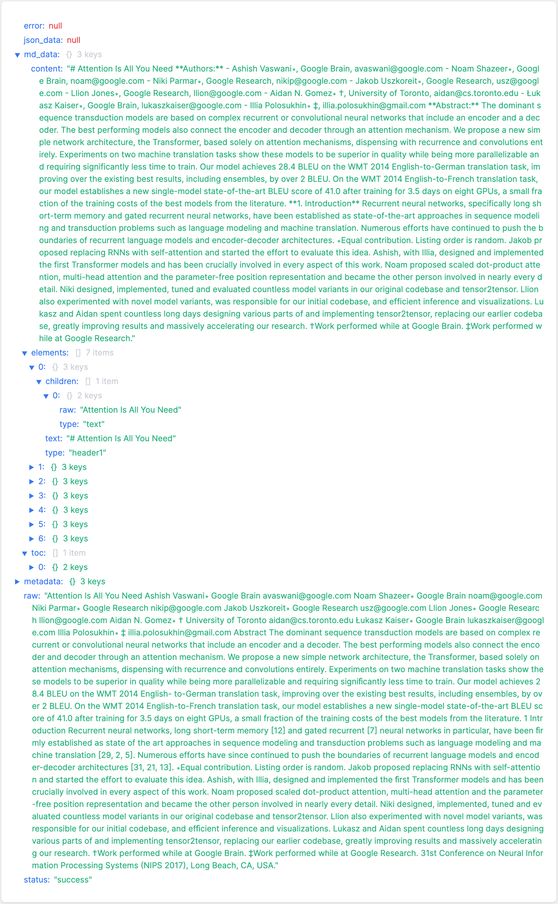
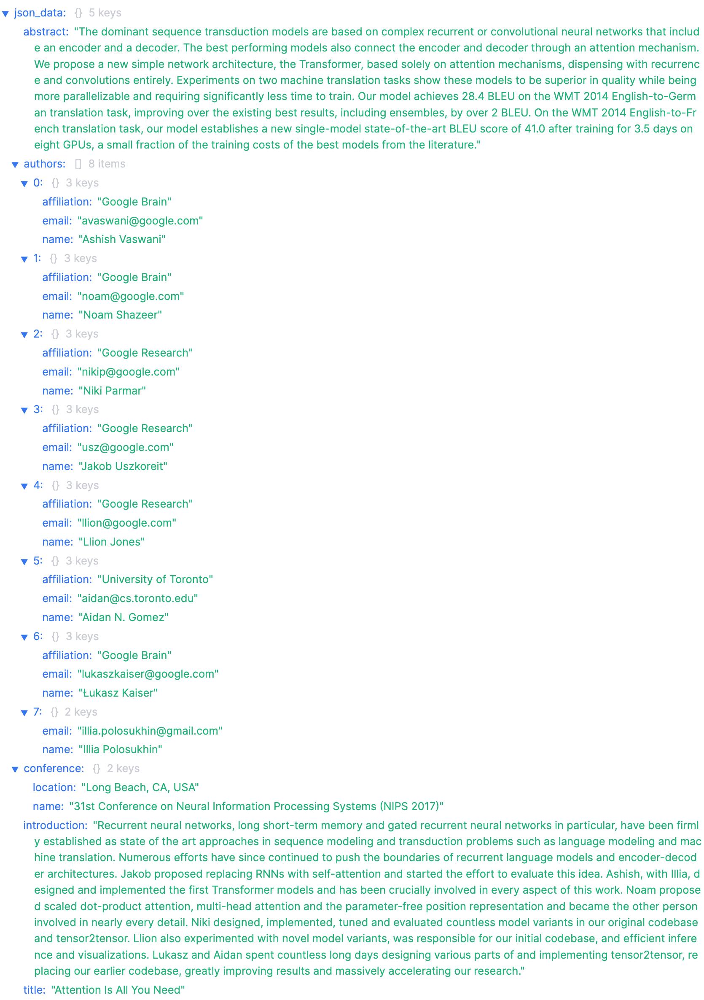
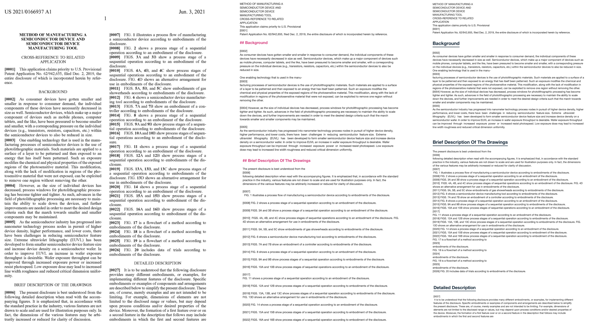

# E2M (Everything to Markdown)

<p align="center">
    <a href="https://github.com/Jing-yilin/E2M">
        
    </a>
</p>

<p align="center">
    <a href="https://github.com/Jing-yilin/E2M">
        
    </a>
    <a href="https://github.com/Jing-yilin/E2M/tags/v1.1.1">
        
    </a>
    <a href="https://hub.docker.com/r/jingyilin/e2m/tags">
        
    </a>
    <a href="https://github.com/Jing-yilin/E2M/blob/main/LICENSE">
        
    </a>
    <a href="https://www.python.org/downloads/">
        
    </a>
</p>

<div align="center">
  <a href="./README.md"></a>
  <a href="./README_CN.md"></a>
</div>

- [E2M (Everything to Markdown)](#e2m-everything-to-markdown)
  - [🌟Introduction](#introduction)
    - [🌐Web](#web)
      - [📃To Markdown](#to-markdown)
      - [📃To Json](#to-json)
    - [📸Demo](#demo)
    - [📂Supported File Types](#supported-file-types)
    - [🗳️Todo](#️todo)
  - [🚀Get Started](#get-started)
    - [📦Quick Start (Remote Docker)](#quick-start-remote-docker)
    - [🐬Run Local Docker](#run-local-docker)
    - [🐬Run Local Docker With GPU](#run-local-docker-with-gpu)
      - [🐧Ubuntu](#ubuntu)
      - [🖥️Windows](#️windows)
    - [⚙️Start From Source Code](#️start-from-source-code)
      - [🐧Ubuntu](#ubuntu-1)
      - [🍏Mac](#mac)
      - [🖥️Windows](#️windows-1)
    - [🔧Set to Development Environment](#set-to-development-environment)
    - [🏭Set to Production Environment](#set-to-production-environment)
    - [📖How to use](#how-to-use)
    - [🔖Language Support](#language-support)
  - [🤝How to contribute](#how-to-contribute)
    - [🌿Create a new branch](#create-a-new-branch)
    - [📝PEP8 style](#pep8-style)
    - [🔄Push to the remote repository](#push-to-the-remote-repository)
    - [🐳Push to docker](#push-to-docker)
    - [🔀Pull Request](#pull-request)
  - [🌟Contributing](#contributing)
    - [👥Contributors](#contributors)
  - [📱Community](#community)
    - [WeChat](#wechat)
    - [Discord](#discord)

## 🌟Introduction

E2M is an API tool converting everything to markdown or json(both LLM-friendly Format).

🔥You'd better set `USE_LLM=True` and use a LLM API to get the best result.

> Why do I create this API? Because I do believe data is the most important thing in this AI era, but many resources are not in the right format. **They are only information, not data.** So I want to create a tool to convert everything to markdown or json, which is the most common format in the AI field. I hope E2M can be used in any AI application that needs format conversion, such as AI knowledge base, AI dataset, etc., so that developers can focus on the core functions of AI applications, not data format conversion.

### 🌐Web


#### 📃To Markdown




<details>
```markdown
{
"error": null,
"json_data": null,
"md_data": {
"content": "# Attention Is All You Need\n\n**Authors:**\n\n- Ashish Vaswani, Google Brain, avaswani@google.com\n- Noam Shazeer, Google Brain, noam@google.com\n- Niki Parmar, Google Research, nikip@google.com\n- Jakob Uszkoreit, Google Research, usz@google.com\n- Llion Jones, Google Research, llion@google.com\n- Aidan N. Gomez, University of Toronto, aidan@cs.toronto.edu\n- Łukasz Kaiser, Google Brain, lukaszkaiser@google.com\n- Illia Polosukhin, illia.polosukhin@gmail.com\n\n**Abstract:**\nThe dominant sequence transduction models are based on complex recurrent or convolutional neural networks that include an encoder and a decoder. The best performing models also connect the encoder and decoder through an attention mechanism. We propose a new simple network architecture, the Transformer, based solely on attention mechanisms, dispensing with recurrence and convolutions entirely. Experiments on two machine translation tasks show these models to be superior in quality while being more parallelizable and requiring significantly less time to train. Our model achieves 28.4 BLEU on the WMT 2014 English-to-German translation task, improving over the existing best results, including ensembles, by over 2 BLEU. On the WMT 2014 English-to-French translation task, our model establishes a new single-model state-of-the-art BLEU score of 41.0 after training for 3.5 days on eight GPUs, a small fraction of the training costs of the best models from the literature.\n\n## Introduction\n\nRecurrent neural networks, long short-term memory and gated recurrent neural networks in particular, have been firmly established as state of the art approaches in sequence modeling and transduction problems such as language modeling and machine translation. Numerous efforts have since continued to push the boundaries of recurrent language models and encoder-decoder architectures.\n\n**Contributions:**\n\n- _Equal contribution. Listing order is random._\n- Jakob proposed replacing RNNs with self-attention and started the effort to evaluate this idea.\n- Ashish, with Illia, designed and implemented the first Transformer models and has been crucially involved in every aspect of this work.\n- Noam proposed scaled dot-product attention, multi-head attention and the parameter-free position representation and became the other person involved in nearly every detail.\n- Niki designed, implemented, tuned and evaluated countless model variants in our original codebase and tensor2tensor.\n- Llion also experimented with novel model variants, was responsible for our initial codebase, and efficient inference and visualizations.\n- Lukasz and Aidan spent countless long days designing various parts of and implementing tensor2tensor, replacing our earlier codebase, greatly improving results and massively accelerating our research.\n\n**Affiliations:**\n\n- _†Work performed while at Google Brain._\n- _‡Work performed while at Google Research._\n\n*31st Conference on Neural Information Processing Systems (NIPS 2017), Long Beach, CA, USA.*",
"elements": [
{
"children": [
{
"raw": "Attention Is All You Need",
"type": "text"
}
],
"text": "# Attention Is All You Need",
"type": "header1"
},
{
"children": [
{
"children": [
{
"raw": "Authors:",
"type": "text"
}
],
"type": "strong"
}
],
"text": "**Authors:**",
"type": "paragraph"
},
{
"children": [
{
"children": [
{
"children": [
{
"raw": "Ashish Vaswani, Google Brain, avaswani@google.com",
"type": "text"
}
],
"type": "block_text"
}
],
"type": "list_item"
},
{
"children": [
{
"children": [
{
"raw": "Noam Shazeer, Google Brain, noam@google.com",
"type": "text"
}
],
"type": "block_text"
}
],
"type": "list_item"
},
{
"children": [
{
"children": [
{
"raw": "Niki Parmar, Google Research, nikip@google.com",
"type": "text"
}
],
"type": "block_text"
}
],
"type": "list_item"
},
{
"children": [
{
"children": [
{
"raw": "Jakob Uszkoreit, Google Research, usz@google.com",
"type": "text"
}
],
"type": "block_text"
}
],
"type": "list_item"
},
{
"children": [
{
"children": [
{
"raw": "Llion Jones, Google Research, llion@google.com",
"type": "text"
}
],
"type": "block_text"
}
],
"type": "list_item"
},
{
"children": [
{
"children": [
{
"raw": "Aidan N. Gomez, University of Toronto, aidan@cs.toronto.edu",
"type": "text"
}
],
"type": "block_text"
}
],
"type": "list_item"
},
{
"children": [
{
"children": [
{
"raw": "Łukasz Kaiser, Google Brain, lukaszkaiser@google.com",
"type": "text"
}
],
"type": "block_text"
}
],
"type": "list_item"
},
{
"children": [
{
"children": [
{
"raw": "Illia Polosukhin, illia.polosukhin@gmail.com",
"type": "text"
}
],
"type": "block_text"
}
],
"type": "list_item"
}
],
"text": "- Ashish Vaswani, Google Brain, avaswani@google.com\n- Noam Shazeer, Google Brain, noam@google.com\n- Niki Parmar, Google Research, nikip@google.com\n- Jakob Uszkoreit, Google Research, usz@google.com\n- Llion Jones, Google Research, llion@google.com\n- Aidan N. Gomez, University of Toronto, aidan@cs.toronto.edu\n- Łukasz Kaiser, Google Brain, lukaszkaiser@google.com\n- Illia Polosukhin, illia.polosukhin@gmail.com",
"type": "list"
},
{
"children": [
{
"children": [
{
"raw": "Abstract:",
"type": "text"
}
],
"type": "strong"
},
{
"type": "softbreak"
},
{
"raw": "The dominant sequence transduction models are based on complex recurrent or convolutional neural networks that include an encoder and a decoder. The best performing models also connect the encoder and decoder through an attention mechanism. We propose a new simple network architecture, the Transformer, based solely on attention mechanisms, dispensing with recurrence and convolutions entirely. Experiments on two machine translation tasks show these models to be superior in quality while being more parallelizable and requiring significantly less time to train. Our model achieves 28.4 BLEU on the WMT 2014 English-to-German translation task, improving over the existing best results, including ensembles, by over 2 BLEU. On the WMT 2014 English-to-French translation task, our model establishes a new single-model state-of-the-art BLEU score of 41.0 after training for 3.5 days on eight GPUs, a small fraction of the training costs of the best models from the literature.",
"type": "text"
}
],
"text": "**Abstract:**\nThe dominant sequence transduction models are based on complex recurrent or convolutional neural networks that include an encoder and a decoder. The best performing models also connect the encoder and decoder through an attention mechanism. We propose a new simple network architecture, the Transformer, based solely on attention mechanisms, dispensing with recurrence and convolutions entirely. Experiments on two machine translation tasks show these models to be superior in quality while being more parallelizable and requiring significantly less time to train. Our model achieves 28.4 BLEU on the WMT 2014 English-to-German translation task, improving over the existing best results, including ensembles, by over 2 BLEU. On the WMT 2014 English-to-French translation task, our model establishes a new single-model state-of-the-art BLEU score of 41.0 after training for 3.5 days on eight GPUs, a small fraction of the training costs of the best models from the literature.",
"type": "paragraph"
},
{
"children": [
{
"raw": "Introduction",
"type": "text"
}
],
"text": "## Introduction",
"type": "header2"
},
{
"children": [
{
"raw": "Recurrent neural networks, long short-term memory and gated recurrent neural networks in particular, have been firmly established as state of the art approaches in sequence modeling and transduction problems such as language modeling and machine translation. Numerous efforts have since continued to push the boundaries of recurrent language models and encoder-decoder architectures.",
"type": "text"
}
],
"text": "Recurrent neural networks, long short-term memory and gated recurrent neural networks in particular, have been firmly established as state of the art approaches in sequence modeling and transduction problems such as language modeling and machine translation. Numerous efforts have since continued to push the boundaries of recurrent language models and encoder-decoder architectures.",
"type": "paragraph"
},
{
"children": [
{
"children": [
{
"raw": "Contributions:",
"type": "text"
}
],
"type": "strong"
}
],
"text": "**Contributions:**",
"type": "paragraph"
},
{
"children": [
{
"children": [
{
"children": [
{
"children": [
{
"raw": "Equal contribution. Listing order is random.",
"type": "text"
}
],
"type": "emphasis"
}
],
"type": "block_text"
}
],
"type": "list_item"
},
{
"children": [
{
"children": [
{
"raw": "Jakob proposed replacing RNNs with self-attention and started the effort to evaluate this idea.",
"type": "text"
}
],
"type": "block_text"
}
],
"type": "list_item"
},
{
"children": [
{
"children": [
{
"raw": "Ashish, with Illia, designed and implemented the first Transformer models and has been crucially involved in every aspect of this work.",
"type": "text"
}
],
"type": "block_text"
}
],
"type": "list_item"
},
{
"children": [
{
"children": [
{
"raw": "Noam proposed scaled dot-product attention, multi-head attention and the parameter-free position representation and became the other person involved in nearly every detail.",
"type": "text"
}
],
"type": "block_text"
}
],
"type": "list_item"
},
{
"children": [
{
"children": [
{
"raw": "Niki designed, implemented, tuned and evaluated countless model variants in our original codebase and tensor2tensor.",
"type": "text"
}
],
"type": "block_text"
}
],
"type": "list_item"
},
{
"children": [
{
"children": [
{
"raw": "Llion also experimented with novel model variants, was responsible for our initial codebase, and efficient inference and visualizations.",
"type": "text"
}
],
"type": "block_text"
}
],
"type": "list_item"
},
{
"children": [
{
"children": [
{
"raw": "Lukasz and Aidan spent countless long days designing various parts of and implementing tensor2tensor, replacing our earlier codebase, greatly improving results and massively accelerating our research.",
"type": "text"
}
],
"type": "block_text"
}
],
"type": "list_item"
}
],
"text": "- _Equal contribution. Listing order is random._\n- Jakob proposed replacing RNNs with self-attention and started the effort to evaluate this idea.\n- Ashish, with Illia, designed and implemented the first Transformer models and has been crucially involved in every aspect of this work.\n- Noam proposed scaled dot-product attention, multi-head attention and the parameter-free position representation and became the other person involved in nearly every detail.\n- Niki designed, implemented, tuned and evaluated countless model variants in our original codebase and tensor2tensor.\n- Llion also experimented with novel model variants, was responsible for our initial codebase, and efficient inference and visualizations.\n- Lukasz and Aidan spent countless long days designing various parts of and implementing tensor2tensor, replacing our earlier codebase, greatly improving results and massively accelerating our research.",
"type": "list"
},
{
"children": [
{
"children": [
{
"raw": "Affiliations:",
"type": "text"
}
],
"type": "strong"
}
],
"text": "**Affiliations:**",
"type": "paragraph"
},
{
"children": [
{
"children": [
{
"children": [
{
"children": [
{
"raw": "†Work performed while at Google Brain.",
"type": "text"
}
],
"type": "emphasis"
}
],
"type": "block_text"
}
],
"type": "list_item"
},
{
"children": [
{
"children": [
{
"children": [
{
"raw": "‡Work performed while at Google Research.",
"type": "text"
}
],
"type": "emphasis"
}
],
"type": "block_text"
}
],
"type": "list_item"
}
],
"text": "- _†Work performed while at Google Brain._\n- _‡Work performed while at Google Research._",
"type": "list"
},
{
"children": [
{
"children": [
{
"raw": "31st Conference on Neural Information Processing Systems (NIPS 2017), Long Beach, CA, USA.",
"type": "text"
}
],
"type": "emphasis"
}
],
"text": "_31st Conference on Neural Information Processing Systems (NIPS 2017), Long Beach, CA, USA._",
"type": "paragraph"
}
],
"toc": [
{
"text": "Attention Is All You Need",
"type": "header1"
},
{
"text": "Introduction",
"type": "header2"
}
]
},
"metadata": {
"file_info": {
"file_hash": "7a6bb1fcdceec29ff330d3af68fbe5d8",
"file_name": "Attention is All You Need Paper.pdf",
"file_path": "./temp/Attention is All You Need Paper.pdf",
"file_size": 569417,
"file_type": "pdf"
},
"llm_info": {
"completion_tokens": 637,
"messages": null,
"model": "gpt-3.5-turbo",
"prompt_tokens": 826,
"successful_requests": 1,
"total_cost": 0.0025129999999999996,
"total_tokens": 1463
},
"request_data": {
"enforced_json_format": "",
"extract_images": false,
"file_hash": "7a6bb1fcdceec29ff330d3af68fbe5d8",
"first_page": 1,
"langs": [
"en",
"zh"
],
"last_page": 1,
"model": "gpt-3.5-turbo",
"parse_mode": "auto",
"return_type": "md",
"save_to_cache": false,
"use_cache": false,
"use_llm": true
}
},
"raw": "Attention Is All You Need\n\nAshish Vaswani∗ Google Brain avaswani@google.com\n\nNoam Shazeer∗ Google Brain noam@google.com\n\nNiki Parmar∗ Google Research nikip@google.com\n\nJakob Uszkoreit∗ Google Research usz@google.com\n\nLlion Jones∗ Google Research llion@google.com\n\nAidan N. Gomez∗ † University of Toronto aidan@cs.toronto.edu\n\nŁukasz Kaiser∗ Google Brain lukaszkaiser@google.com\n\nIllia Polosukhin∗ ‡ illia.polosukhin@gmail.com\n\nAbstract\n\nThe dominant sequence transduction models are based on complex recurrent or convolutional neural networks that include an encoder and a decoder. The best performing models also connect the encoder and decoder through an attention mechanism. We propose a new simple network architecture, the Transformer, based solely on attention mechanisms, dispensing with recurrence and convolutions entirely. Experiments on two machine translation tasks show these models to be superior in quality while being more parallelizable and requiring significantly less time to train. Our model achieves 28.4 BLEU on the WMT 2014 English- to-German translation task, improving over the existing best results, including ensembles, by over 2 BLEU. On the WMT 2014 English-to-French translation task, our model establishes a new single-model state-of-the-art BLEU score of 41.0 after training for 3.5 days on eight GPUs, a small fraction of the training costs of the best models from the literature.\n\n1\n\nIntroduction\n\nRecurrent neural networks, long short-term memory [12] and gated recurrent [7] neural networks in particular, have been firmly established as state of the art approaches in sequence modeling and transduction problems such as language modeling and machine translation [29, 2, 5]. Numerous efforts have since continued to push the boundaries of recurrent language models and encoder-decoder architectures [31, 21, 13].\n\n∗Equal contribution. Listing order is random. Jakob proposed replacing RNNs with self-attention and started the effort to evaluate this idea. Ashish, with Illia, designed and implemented the first Transformer models and has been crucially involved in every aspect of this work. Noam proposed scaled dot-product attention, multi-head attention and the parameter-free position representation and became the other person involved in nearly every detail. Niki designed, implemented, tuned and evaluated countless model variants in our original codebase and tensor2tensor. Llion also experimented with novel model variants, was responsible for our initial codebase, and efficient inference and visualizations. Lukasz and Aidan spent countless long days designing various parts of and implementing tensor2tensor, replacing our earlier codebase, greatly improving results and massively accelerating our research.\n\n†Work performed while at Google Brain. ‡Work performed while at Google Research.\n\n31st Conference on Neural Information Processing Systems (NIPS 2017), Long Beach, CA, USA.",
"status": "success"
}
```
</details>

#### 📃To Json



<details>
```json
{
    "error": null,
    "json_data": {
        "abstract": "The dominant sequence transduction models are based on complex recurrent or convolutional neural networks that include an encoder and a decoder. The best performing models also connect the encoder and decoder through an attention mechanism. We propose a new simple network architecture, the Transformer, based solely on attention mechanisms, dispensing with recurrence and convolutions entirely. Experiments on two machine translation tasks show these models to be superior in quality while being more parallelizable and requiring significantly less time to train. Our model achieves 28.4 BLEU on the WMT 2014 English-to-German translation task, improving over the existing best results, including ensembles, by over 2 BLEU. On the WMT 2014 English-to-French translation task, our model establishes a new single-model state-of-the-art BLEU score of 41.0 after training for 3.5 days on eight GPUs, a small fraction of the training costs of the best models from the literature.",
        "authors": [
            {
                "affiliation": "Google Brain",
                "email": "avaswani@google.com",
                "name": "Ashish Vaswani"
            },
            {
                "affiliation": "Google Brain",
                "email": "noam@google.com",
                "name": "Noam Shazeer"
            },
            {
                "affiliation": "Google Research",
                "email": "nikip@google.com",
                "name": "Niki Parmar"
            },
            {
                "affiliation": "Google Research",
                "email": "usz@google.com",
                "name": "Jakob Uszkoreit"
            },
            {
                "affiliation": "Google Research",
                "email": "llion@google.com",
                "name": "Llion Jones"
            },
            {
                "affiliation": "University of Toronto",
                "email": "aidan@cs.toronto.edu",
                "name": "Aidan N. Gomez"
            },
            {
                "affiliation": "Google Brain",
                "email": "lukaszkaiser@google.com",
                "name": "Łukasz Kaiser"
            },
            {
                "email": "illia.polosukhin@gmail.com",
                "name": "Illia Polosukhin"
            }
        ],
        "conference": {
            "location": "Long Beach, CA, USA",
            "name": "31st Conference on Neural Information Processing Systems (NIPS 2017)"
        },
        "introduction": "Recurrent neural networks, long short-term memory and gated recurrent neural networks in particular, have been firmly established as state of the art approaches in sequence modeling and transduction problems such as language modeling and machine translation. Numerous efforts have since continued to push the boundaries of recurrent language models and encoder-decoder architectures. Jakob proposed replacing RNNs with self-attention and started the effort to evaluate this idea. Ashish, with Illia, designed and implemented the first Transformer models and has been crucially involved in every aspect of this work. Noam proposed scaled dot-product attention, multi-head attention and the parameter-free position representation and became the other person involved in nearly every detail. Niki designed, implemented, tuned and evaluated countless model variants in our original codebase and tensor2tensor. Llion also experimented with novel model variants, was responsible for our initial codebase, and efficient inference and visualizations. Lukasz and Aidan spent countless long days designing various parts of and implementing tensor2tensor, replacing our earlier codebase, greatly improving results and massively accelerating our research.",
        "title": "Attention Is All You Need"
    },
    "md_data": null,
    "metadata": {
        "file_info": {
            "file_hash": "7a6bb1fcdceec29ff330d3af68fbe5d8",
            "file_name": "Attention is All You Need Paper.pdf",
            "file_path": "./temp/Attention is All You Need Paper.pdf",
            "file_size": 569417,
            "file_type": "pdf"
        },
        "llm_info": {
            "completion_tokens": 761,
            "messages": null,
            "model": "gpt-3.5-turbo",
            "prompt_tokens": 843,
            "successful_requests": 1,
            "total_cost": 0.0027865,
            "total_tokens": 1604
        },
        "request_data": {
            "enforced_json_format": "",
            "extract_images": false,
            "file_hash": "7a6bb1fcdceec29ff330d3af68fbe5d8",
            "first_page": 1,
            "langs": ["en", "zh"],
            "last_page": 1,
            "model": "gpt-3.5-turbo",
            "parse_mode": "auto",
            "return_type": "json",
            "save_to_cache": false,
            "use_cache": false,
            "use_llm": true
        }
    },
    "raw": "Attention Is All You Need\n\nAshish Vaswani∗ Google Brain avaswani@google.com\n\nNoam Shazeer∗ Google Brain noam@google.com\n\nNiki Parmar∗ Google Research nikip@google.com\n\nJakob Uszkoreit∗ Google Research usz@google.com\n\nLlion Jones∗ Google Research llion@google.com\n\nAidan N. Gomez∗ † University of Toronto aidan@cs.toronto.edu\n\nŁukasz Kaiser∗ Google Brain lukaszkaiser@google.com\n\nIllia Polosukhin∗ ‡ illia.polosukhin@gmail.com\n\nAbstract\n\nThe dominant sequence transduction models are based on complex recurrent or convolutional neural networks that include an encoder and a decoder. The best performing models also connect the encoder and decoder through an attention mechanism. We propose a new simple network architecture, the Transformer, based solely on attention mechanisms, dispensing with recurrence and convolutions entirely. Experiments on two machine translation tasks show these models to be superior in quality while being more parallelizable and requiring significantly less time to train. Our model achieves 28.4 BLEU on the WMT 2014 English- to-German translation task, improving over the existing best results, including ensembles, by over 2 BLEU. On the WMT 2014 English-to-French translation task, our model establishes a new single-model state-of-the-art BLEU score of 41.0 after training for 3.5 days on eight GPUs, a small fraction of the training costs of the best models from the literature.\n\n1\n\nIntroduction\n\nRecurrent neural networks, long short-term memory [12] and gated recurrent [7] neural networks in particular, have been firmly established as state of the art approaches in sequence modeling and transduction problems such as language modeling and machine translation [29, 2, 5]. Numerous efforts have since continued to push the boundaries of recurrent language models and encoder-decoder architectures [31, 21, 13].\n\n∗Equal contribution. Listing order is random. Jakob proposed replacing RNNs with self-attention and started the effort to evaluate this idea. Ashish, with Illia, designed and implemented the first Transformer models and has been crucially involved in every aspect of this work. Noam proposed scaled dot-product attention, multi-head attention and the parameter-free position representation and became the other person involved in nearly every detail. Niki designed, implemented, tuned and evaluated countless model variants in our original codebase and tensor2tensor. Llion also experimented with novel model variants, was responsible for our initial codebase, and efficient inference and visualizations. Lukasz and Aidan spent countless long days designing various parts of and implementing tensor2tensor, replacing our earlier codebase, greatly improving results and massively accelerating our research.\n\n†Work performed while at Google Brain. ‡Work performed while at Google Research.\n\n31st Conference on Neural Information Processing Systems (NIPS 2017), Long Beach, CA, USA.",
    "status": "success"
}
```
</details>

### 📸Demo




### 📂Supported File Types

<table style="width: 100%;">
  <tr>
    <th align="center">Supported</th>
    <th align="center">Document</th>
    <th align="center">Image</th>
    <th align="center">Data</th>
    <th align="center">Audio</th>
    <th align="center">Video</th>
  </tr>
  <tr>
    <td align="center">Done</td>
    <td align="center">doc, docx, pdf</td>
    <td align="center"></td>
    <td align="center"></td>
    <td align="center"></td>
    <td align="center"></td>
  </tr>
  <tr>
    <td align="center">Todo</td>
    <td align="center">html, htm</td>
    <td align="center">jpg, jpeg, png, gif, svg</td>
    <td align="center">csv, xlsx, xls</td>
    <td align="center">mp3, wav, flac</td>
    <td align="center">mp4, avi, mkv</td>
  </tr>
</table>

### 🗳️Todo

- [x] ParseMode: `auto`, `ocr-low(tesseract)`, `ocr-high(Surya)`, `fast`
- [x] Update API structure
- [ ] Support long text parsing
- [ ] Add a new table to store raw data
- [ ] Add stream mode in API and frontend
- [ ] Add Async feature in API
- [ ] Develop a SDK for E2M API
- [ ] Add more LLM API
- [ ] Open an online demo

## 🚀Get Started

### 📦Quick Start (Remote Docker)

> You should have `docker` and `docker-compose` installed on your machine in advance.

```bash
git clone https://github.com/Jing-yilin/E2M
cd E2M/docker
# edit the docker-compose.yml file, set `USE_LLM` to `True`, and add your API key
# deploy the app with docker, detach mode
docker-compose up --build -d
# check the logs with
docker-compose logs -f
# remove the container with
docker-compose down
```

If you have GPU support, you can use the `docker-compose.gpu.yml` file:

```bash
docker-compose -f docker-compose.gpu.yml up --build -d
```

### 🐬Run Local Docker

> You should have `docker` and `docker-compose` installed on your machine in advance.

```bash
git clone https://github.com/Jing-yilin/E2M
cd E2M
# edit the docker-compose.yml file, set `USE_LLM` to `True`, and add your API key
# deploy the app with docker, detach mode
docker-compose up --build -d
# check the logs with
docker-compose logs -f
# remove the container with
docker-compose down
```

- 🚀Web: [http://127.0.0.1:3000](http://127.0.0.1:3000)
- 🚀API: [http://127.0.0.1:8765/api/v1/](http://127.0.0.1:8765/api/v1/)
- 🚀API doc: [http://127.0.0.1:8765/swagger/](http://127.0.0.1:8765/swagger/)

### 🐬Run Local Docker With GPU

#### 🐧Ubuntu

To utilize the local GPU, follow these steps:

1. Install NVIDIA Driver: Ensure the NVIDIA driver is installed on your host machine.

2. Install NVIDIA Container Toolkit:

```bash
distribution=$(. /etc/os-release;echo $ID$VERSION_ID)
curl -s -L https://nvidia.github.io/nvidia-docker/gpgkey | sudo apt-key add -
curl -s -L https://nvidia.github.io/nvidia-docker/$distribution/nvidia-docker.list | sudo tee /etc/apt/sources.list.d/nvidia-docker.list
sudo apt-get update
sudo apt-get install -y nvidia-docker2
sudo systemctl restart docker
```

> You may have to update your docker version if you encounter any issues.

1. Run Docker Container with GPU Support:

```bash
docker-compose -f docker-compose.gpu.yml up --build -d
# edit the docker-compose.yml file, set `USE_LLM` to `True`, and add your API key
# check the logs with
docker-compose -f docker-compose.gpu.yml logs -f
# remove the container with
docker-compose -f docker-compose.gpu.yml down
```

- 🚀Web: [http://127.0.0.1:3000](http://127.0.0.1:3000)
- 🚀API: [http://127.0.0.1:8765/api/v1/](http://127.0.0.1:8765/api/v1/)
- 🚀API doc: [http://127.0.0.1:8765/swagger/](http://127.0.0.1:8765/swagger/)

#### 🖥️Windows

If you are using Windows, you can use Docker Desktop with GPU support.

> You can refer to: [https://docs.docker.com/desktop/gpu/](https://docs.docker.com/desktop/gpu/)

Then you can run docker-compose as usual:

```bash
git clone https://github.com/Jing-yilin/E2M
cd E2M
docker-compose -f docker-compose.gpu.yml up --build -d
# check the logs with
docker-compose -f docker-compose.gpu.yml logs -f
# remove the container with
docker-compose -f docker-compose.gpu.yml down
```

### ⚙️Start From Source Code

Install:

```bash
git clone https://github.com/Jing-yilin/E2M
cd E2M/app
conda create -n e2m python=3.10 -y
conda activate e2m
python -m pip install -r requirements-dev.txt
```

First, you should install `postgresql@15.0` and `libreoffice`:

#### 🐧Ubuntu

1. Install PostgreSQL 15 and LibreOffice:

    > Reference: [How to Install PostgreSQL On Ubuntu](https://www.linuxtechi.com/how-to-install-postgresql-on-ubuntu/)

    ```sh
    sudo sh -c 'echo "deb http://apt.postgresql.org/pub/repos/apt $(lsb_release -cs)-pgdg main" > /etc/apt/sources.list.d/pgdg.list'
    wget -qO- https://www.postgresql.org/media/keys/ACCC4CF8.asc | sudo tee /etc/apt/trusted.gpg.d/pgdg.asc &>/dev/null
    sudo apt update
    sudo apt install postgresql-15 postgresql-client-15 -y
    sudo apt install libreoffice -y
    ```

2. Start PostgreSQL:
    ```sh
    sudo systemctl status postgresql
    ```

#### 🍏Mac

1. Install PostgreSQL 15 and LibreOffice:
    ```sh
    brew install postgresql@15 -y
    brew install --cask libreoffice -y
    ```
2. Start PostgreSQL:
    ```sh
    brew services start postgresql@15
    ```

#### 🖥️Windows

1. Install PostgreSQL 15 and LibreOffice:

    ```sh
    choco install postgresql15 --version=15.0.1 -y
    choco install libreoffice -y
    ```

    _You may have to run the cmd as an administrator_

    > Also, you can download the libreoffice from [here](https://www.libreoffice.org/download/download/)

2. Start PostgreSQL:
    ```sh
    pg_ctl -D "C:\Program Files\PostgreSQL\15\data" start
    ```

Then, you need to migrate the database:

> You have to change the `DB_ADMIN` and `DB_PASSWORD` in the `setup_db.sh` file.

```bash
# make sure you are in E2M/app
# Please change DB_ADMIN and DB_PASSWORD to your own settings
chmod +x ./setup_db.sh
./setup_db.sh
```

Then you can start the API with the following command:

```bash
flask run --host 0.0.0.0 --port=8765 # --debug
```

If you want a web page, you can start the web with the following command:

```bash
cd web
npm install
npm run start
```

### 🔧Set to Development Environment

```bash
export FLASK_ENV=development
export FLASK_DEBUG=1
```

### 🏭Set to Production Environment

```bash
export FLASK_ENV=production
export FLASK_DEBUG=0
```

### 📖How to use

bash script:

```bash
curl -X POST "http://127.0.0.1:8765/api/v1/convert" \
  -H "accept: application/json" \
  -H "Content-Type: multipart/form-data; charset=utf-8" \
  -H "Accept-Charset: utf-8" \
  -F "file=@/path/to/file.docx" \
  -F "parse_mode=auto"
```

return:

```json
{
    "message": "This is your markdown content"
}
```

### 🔖Language Support

Currently, only English and Chinese are supported. 

```json
{
    "af": "Afrikaans",
    "am": "Amharic",
    "ar": "Arabic",
    "as": "Assamese",
    "az": "Azerbaijani",
    "be": "Belarusian",
    "bg": "Bulgarian",
    "bn": "Bengali",
    "br": "Breton",
    "bs": "Bosnian",
    "ca": "Catalan",
    "cs": "Czech",
    "cy": "Welsh",
    "da": "Danish",
    "de": "German",
    "el": "Greek",
    "en": "English",
    "eo": "Esperanto",
    "es": "Spanish",
    "et": "Estonian",
    "eu": "Basque",
    "fa": "Persian",
    "fi": "Finnish",
    "fr": "French",
    "fy": "Western Frisian",
    "ga": "Irish",
    "gd": "Scottish Gaelic",
    "gl": "Galician",
    "gu": "Gujarati",
    "ha": "Hausa",
    "he": "Hebrew",
    "hi": "Hindi",
    "hr": "Croatian",
    "hu": "Hungarian",
    "hy": "Armenian",
    "id": "Indonesian",
    "is": "Icelandic",
    "it": "Italian",
    "ja": "Japanese",
    "jv": "Javanese",
    "ka": "Georgian",
    "kk": "Kazakh",
    "km": "Khmer",
    "kn": "Kannada",
    "ko": "Korean",
    "ku": "Kurdish",
    "ky": "Kyrgyz",
    "la": "Latin",
    "lo": "Lao",
    "lt": "Lithuanian",
    "lv": "Latvian",
    "mg": "Malagasy",
    "mk": "Macedonian",
    "ml": "Malayalam",
    "mn": "Mongolian",
    "mr": "Marathi",
    "ms": "Malay",
    "my": "Burmese",
    "ne": "Nepali",
    "nl": "Dutch",
    "no": "Norwegian",
    "om": "Oromo",
    "or": "Oriya",
    "pa": "Punjabi",
    "pl": "Polish",
    "ps": "Pashto",
    "pt": "Portuguese",
    "ro": "Romanian",
    "ru": "Russian",
    "sa": "Sanskrit",
    "sd": "Sindhi",
    "si": "Sinhala",
    "sk": "Slovak",
    "sl": "Slovenian",
    "so": "Somali",
    "sq": "Albanian",
    "sr": "Serbian",
    "su": "Sundanese",
    "sv": "Swedish",
    "sw": "Swahili",
    "ta": "Tamil",
    "te": "Telugu",
    "th": "Thai",
    "tl": "Tagalog",
    "tr": "Turkish",
    "ug": "Uyghur",
    "uk": "Ukrainian",
    "ur": "Urdu",
    "uz": "Uzbek",
    "vi": "Vietnamese",
    "xh": "Xhosa",
    "yi": "Yiddish",
    "zh": "Chinese"
}
```

## 🤝How to contribute

### 🌿Create a new branch

Before you commit your code, please create a new branch:

- `feature/xxx` for new features
- `bugfix/xxx` for bug fixes

You can create a new branch with the following command:

```bash
# fetch the latest cod
git checkout main
git pull
# create a new branch
git checkout -b feature/xxx
```

### 📝PEP8 style

Then, run the following commands to format the style of your code:

```bash
# all contributions should follow PEP8 style
flake8 .  # to check the style
black .  # to format the code
pymarkdownlnt fix .  # to format the markdown
cd app
poetry export -f requirements.txt --without-hashes > requirements.txt
poetry export -f requirements.txt --without-hashes --with dev -o requirements-dev.txt
```

### 🔄Push to the remote repository

```bash
# add the changes
git add .
# commit the changes
git commit -m "your commit message"
# push the changes
git push origin feature/xxx # or simply `git push`
```

### 🐳Push to docker

A new version:

```
cd app
docker build -t jingyilin/e2m_api:<version> .
docker push jingyilin/e2m_api:<version>
cd ../web
docker build -t jingyilin/e2m_web:<version> .
docker push jingyilin/e2m_web:<version>
```

For example, the version is `v1.0.0`:

```
cd app
docker build -t jingyilin/e2m_api:v1.0.0 .
docker push jingyilin/e2m_api:v1.0.0
cd ../web
docker build -t jingyilin/e2m_web:v1.0.0 .
docker push jingyilin/e2m_web:v1.0.0
```

### 🔀Pull Request

```bash
# create a pull request to develop branch on GitHub
```

## 🌟Contributing

### 👥Contributors

<a href="https://github.com/Jing-yilin/E2M/graphs/contributors">
  
</a>

## 📱Community

### WeChat


### Discord


