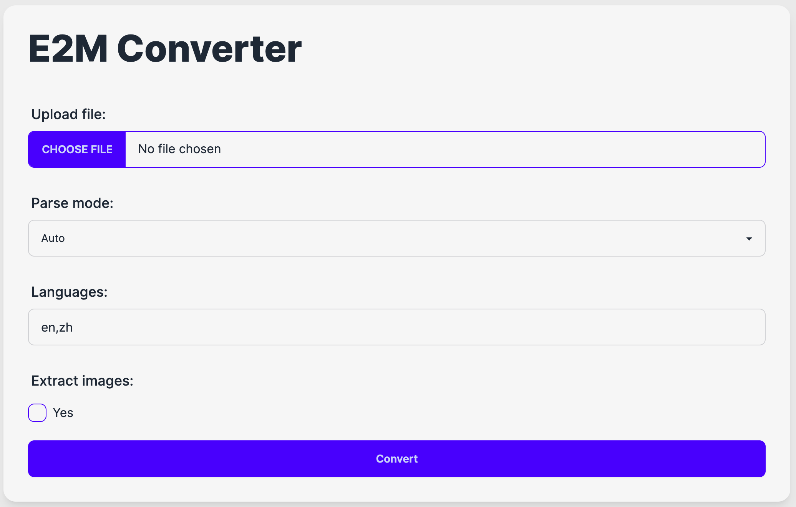
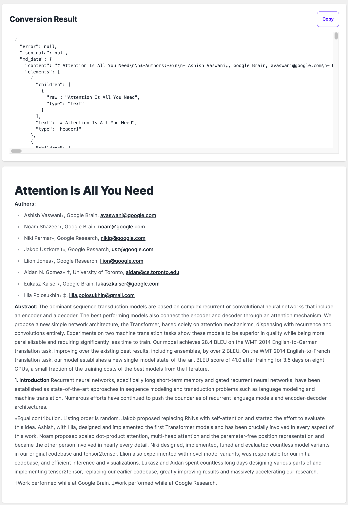
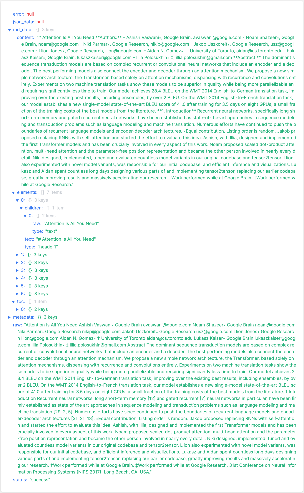
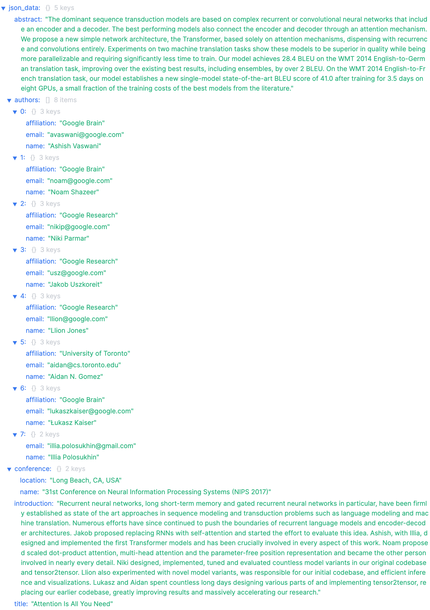
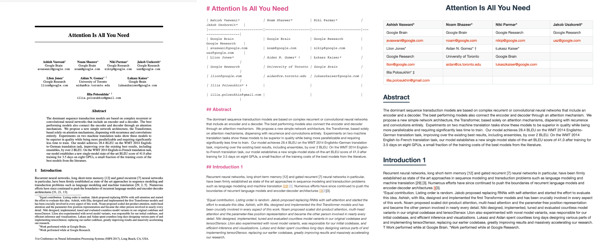
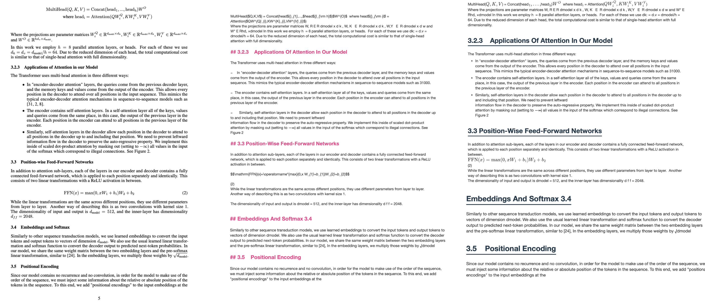
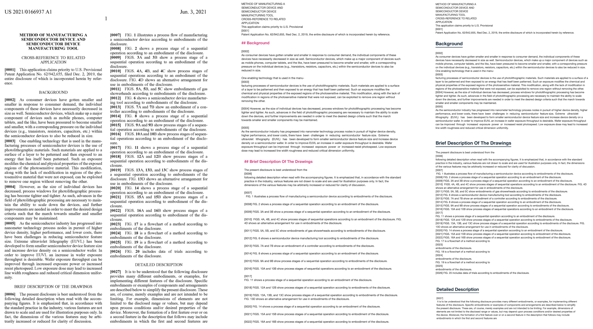

# E2M (Everything to Markdown)

<p align="center">
    <a href="https://github.com/Jing-yilin/E2M">
        
    </a>
</p>

<p align="center">
    <a href="https://github.com/Jing-yilin/E2M">
        
    </a>
    <a href="https://github.com/Jing-yilin/E2M/tags/v1.1.2">
        
    </a>
    <a href="https://hub.docker.com/r/jingyilin/e2m/tags">
        
    </a>
    <a href="https://github.com/Jing-yilin/E2M/blob/main/LICENSE">
        
    </a>
    <a href="https://www.python.org/downloads/">
        
    </a>
</p>

<div align="center">
  <a href="./README.md"></a>
  <a href="./README_CN.md"></a>
</div>

- [E2M (Everything to Markdown)](#e2m-everything-to-markdown)
  - [🌟 介绍](#-介绍)
    - [🌐 网页](#-网页)
      - [📃 转换为 Markdown](#-转换为-markdown)
      - [📃 转换为 Json](#-转换为-json)
    - [📸 演示](#-演示)
    - [📂 支持的文件类型](#-支持的文件类型)
    - [🗳️ 待完成](#️-待完成)
  - [🚀 快速开始](#-快速开始)
    - [📦 快速启动（远程 docker）](#-快速启动远程-docker)
    - [🐬 运行本地 Docker](#-运行本地-docker)
    - [🐬 运行本地 Docker-GPU 版本](#-运行本地-docker-gpu-版本)
      - [🐧Ubuntu](#ubuntu)
      - [🖥️Windows](#️windows)
    - [⚙️ 从源码开始](#️-从源码开始)
      - [🐧Ubuntu](#ubuntu-1)
      - [🍏Mac](#mac)
      - [🖥️Windows](#️windows-1)
    - [🔧 设置开发环境](#-设置开发环境)
    - [🏭 设置生产环境](#-设置生产环境)
    - [📖 如何使用](#-如何使用)
    - [🔖 语言支持](#-语言支持)
  - [🤝 如何贡献](#-如何贡献)
    - [🌿 创建新分支](#-创建新分支)
    - [📝PEP8 风格](#pep8-风格)
    - [🔄 推送到远程仓库](#-推送到远程仓库)
    - [🐳 推送到 Docker](#-推送到-docker)
    - [🔀 拉取请求](#-拉取请求)
  - [🌟 贡献者](#-贡献者)
    - [👥 贡献者名单](#-贡献者名单)
  - [📱 社区](#-社区)
    - [微信](#微信)
    - [Discord](#discord)

## 🌟 介绍

✨ 当前版本: `v1.1.2`

🦄E2M 是一个能够将所有文件转换为 Markdown 或 JSON（两者都是 LLM 友好格式）的 API 工具。

🔥 最好在环境中设置 `USE_LLM=True` 并使用 LLM API 以获得最佳结果。

> 为什么我创建这个 API？因为我坚信在这个 AI 时代，数据是最重要的东西，但许多资源并不是以正确的格式存在的。**它们只是信息，而不是数据。** 所以我想创建一个工具，将一切转换为 Markdown 或 JSON，这在 AI 领域是最常见的格式。我希望 E2M 能被用在任何需要格式转换的 AI 应用上，比如 AI 知识库、AI 数据集等，那么开发者就可以专注于 AI 应用的核心功能，而不是数据格式转换。

### 🌐 网页



#### 📃 转换为 Markdown





<details>
```markdown
{
"error": null,
"json_data": null,
"md_data": {
"content": "# Attention Is All You Need\n\n**Authors:**\n\n- Ashish Vaswani, Google Brain, avaswani@google.com\n- Noam Shazeer, Google Brain, noam@google.com\n- Niki Parmar, Google Research, nikip@google.com\n- Jakob Uszkoreit, Google Research, usz@google.com\n- Llion Jones, Google Research, llion@google.com\n- Aidan N. Gomez, University of Toronto, aidan@cs.toronto.edu\n- Łukasz Kaiser, Google Brain, lukaszkaiser@google.com\n- Illia Polosukhin, illia.polosukhin@gmail.com\n\n**Abstract:**\nThe dominant sequence transduction models are based on complex recurrent or convolutional neural networks that include an encoder and a decoder. The best performing models also connect the encoder and decoder through an attention mechanism. We propose a new simple network architecture, the Transformer, based solely on attention mechanisms, dispensing with recurrence and convolutions entirely. Experiments on two machine translation tasks show these models to be superior in quality while being more parallelizable and requiring significantly less time to train. Our model achieves 28.4 BLEU on the WMT 2014 English-to-German translation task, improving over the existing best results, including ensembles, by over 2 BLEU. On the WMT 2014 English-to-French translation task, our model establishes a new single-model state-of-the-art BLEU score of 41.0 after training for 3.5 days on eight GPUs, a small fraction of the training costs of the best models from the literature.\n\n## Introduction\n\nRecurrent neural networks, long short-term memory and gated recurrent neural networks in particular, have been firmly established as state of the art approaches in sequence modeling and transduction problems such as language modeling and machine translation. Numerous efforts have since continued to push the boundaries of recurrent language models and encoder-decoder architectures.\n\n**Contributions:**\n\n- _Equal contribution. Listing order is random._\n- Jakob proposed replacing RNNs with self-attention and started the effort to evaluate this idea.\n- Ashish, with Illia, designed and implemented the first Transformer models and has been crucially involved in every aspect of this work.\n- Noam proposed scaled dot-product attention, multi-head attention and the parameter-free position representation and became the other person involved in nearly every detail.\n- Niki designed, implemented, tuned and evaluated countless model variants in our original codebase and tensor2tensor.\n- Llion also experimented with novel model variants, was responsible for our initial codebase, and efficient inference and visualizations.\n- Lukasz and Aidan spent countless long days designing various parts of and implementing tensor2tensor, replacing our earlier codebase, greatly improving results and massively accelerating our research.\n\n**Affiliations:**\n\n- _†Work performed while at Google Brain._\n- _‡Work performed while at Google Research._\n\n*31st Conference on Neural Information Processing Systems (NIPS 2017), Long Beach, CA, USA.*",
"elements": [
{
"children": [
{
"raw": "Attention Is All You Need",
"type": "text"
}
],
"text": "# Attention Is All You Need",
"type": "header1"
},
{
"children": [
{
"children": [
{
"raw": "Authors:",
"type": "text"
}
],
"type": "strong"
}
],
"text": "**Authors:**",
"type": "paragraph"
},
{
"children": [
{
"children": [
{
"children": [
{
"raw": "Ashish Vaswani, Google Brain, avaswani@google.com",
"type": "text"
}
],
"type": "block_text"
}
],
"type": "list_item"
},
{
"children": [
{
"children": [
{
"raw": "Noam Shazeer, Google Brain, noam@google.com",
"type": "text"
}
],
"type": "block_text"
}
],
"type": "list_item"
},
{
"children": [
{
"children": [
{
"raw": "Niki Parmar, Google Research, nikip@google.com",
"type": "text"
}
],
"type": "block_text"
}
],
"type": "list_item"
},
{
"children": [
{
"children": [
{
"raw": "Jakob Uszkoreit, Google Research, usz@google.com",
"type": "text"
}
],
"type": "block_text"
}
],
"type": "list_item"
},
{
"children": [
{
"children": [
{
"raw": "Llion Jones, Google Research, llion@google.com",
"type": "text"
}
],
"type": "block_text"
}
],
"type": "list_item"
},
{
"children": [
{
"children": [
{
"raw": "Aidan N. Gomez, University of Toronto, aidan@cs.toronto.edu",
"type": "text"
}
],
"type": "block_text"
}
],
"type": "list_item"
},
{
"children": [
{
"children": [
{
"raw": "Łukasz Kaiser, Google Brain, lukaszkaiser@google.com",
"type": "text"
}
],
"type": "block_text"
}
],
"type": "list_item"
},
{
"children": [
{
"children": [
{
"raw": "Illia Polosukhin, illia.polosukhin@gmail.com",
"type": "text"
}
],
"type": "block_text"
}
],
"type": "list_item"
}
],
"text": "- Ashish Vaswani, Google Brain, avaswani@google.com\n- Noam Shazeer, Google Brain, noam@google.com\n- Niki Parmar, Google Research, nikip@google.com\n- Jakob Uszkoreit, Google Research, usz@google.com\n- Llion Jones, Google Research, llion@google.com\n- Aidan N. Gomez, University of Toronto, aidan@cs.toronto.edu\n- Łukasz Kaiser, Google Brain, lukaszkaiser@google.com\n- Illia Polosukhin, illia.polosukhin@gmail.com",
"type": "list"
},
{
"children": [
{
"children": [
{
"raw": "Abstract:",
"type": "text"
}
],
"type": "strong"
},
{
"type": "softbreak"
},
{
"raw": "The dominant sequence transduction models are based on complex recurrent or convolutional neural networks that include an encoder and a decoder. The best performing models also connect the encoder and decoder through an attention mechanism. We propose a new simple network architecture, the Transformer, based solely on attention mechanisms, dispensing with recurrence and convolutions entirely. Experiments on two machine translation tasks show these models to be superior in quality while being more parallelizable and requiring significantly less time to train. Our model achieves 28.4 BLEU on the WMT 2014 English-to-German translation task, improving over the existing best results, including ensembles, by over 2 BLEU. On the WMT 2014 English-to-French translation task, our model establishes a new single-model state-of-the-art BLEU score of 41.0 after training for 3.5 days on eight GPUs, a small fraction of the training costs of the best models from the literature.",
"type": "text"
}
],
"text": "**Abstract:**\nThe dominant sequence transduction models are based on complex recurrent or convolutional neural networks that include an encoder and a decoder. The best performing models also connect the encoder and decoder through an attention mechanism. We propose a new simple network architecture, the Transformer, based solely on attention mechanisms, dispensing with recurrence and convolutions entirely. Experiments on two machine translation tasks show these models to be superior in quality while being more parallelizable and requiring significantly less time to train. Our model achieves 28.4 BLEU on the WMT 2014 English-to-German translation task, improving over the existing best results, including ensembles, by over 2 BLEU. On the WMT 2014 English-to-French translation task, our model establishes a new single-model state-of-the-art BLEU score of 41.0 after training for 3.5 days on eight GPUs, a small fraction of the training costs of the best models from the literature.",
"type": "paragraph"
},
{
"children": [
{
"raw": "Introduction",
"type": "text"
}
],
"text": "## Introduction",
"type": "header2"
},
{
"children": [
{
"raw": "Recurrent neural networks, long short-term memory and gated recurrent neural networks in particular, have been firmly established as state of the art approaches in sequence modeling and transduction problems such as language modeling and machine translation. Numerous efforts have since continued to push the boundaries of recurrent language models and encoder-decoder architectures.",
"type": "text"
}
],
"text": "Recurrent neural networks, long short-term memory and gated recurrent neural networks in particular, have been firmly established as state of the art approaches in sequence modeling and transduction problems such as language modeling and machine translation. Numerous efforts have since continued to push the boundaries of recurrent language models and encoder-decoder architectures.",
"type": "paragraph"
},
{
"children": [
{
"children": [
{
"raw": "Contributions:",
"type": "text"
}
],
"type": "strong"
}
],
"text": "**Contributions:**",
"type": "paragraph"
},
{
"children": [
{
"children": [
{
"children": [
{
"children": [
{
"raw": "Equal contribution. Listing order is random.",
"type": "text"
}
],
"type": "emphasis"
}
],
"type": "block_text"
}
],
"type": "list_item"
},
{
"children": [
{
"children": [
{
"raw": "Jakob proposed replacing RNNs with self-attention and started the effort to evaluate this idea.",
"type": "text"
}
],
"type": "block_text"
}
],
"type": "list_item"
},
{
"children": [
{
"children": [
{
"raw": "Ashish, with Illia, designed and implemented the first Transformer models and has been crucially involved in every aspect of this work.",
"type": "text"
}
],
"type": "block_text"
}
],
"type": "list_item"
},
{
"children": [
{
"children": [
{
"raw": "Noam proposed scaled dot-product attention, multi-head attention and the parameter-free position representation and became the other person involved in nearly every detail.",
"type": "text"
}
],
"type": "block_text"
}
],
"type": "list_item"
},
{
"children": [
{
"children": [
{
"raw": "Niki designed, implemented, tuned and evaluated countless model variants in our original codebase and tensor2tensor.",
"type": "text"
}
],
"type": "block_text"
}
],
"type": "list_item"
},
{
"children": [
{
"children": [
{
"raw": "Llion also experimented with novel model variants, was responsible for our initial codebase, and efficient inference and visualizations.",
"type": "text"
}
],
"type": "block_text"
}
],
"type": "list_item"
},
{
"children": [
{
"children": [
{
"raw": "Lukasz and Aidan spent countless long days designing various parts of and implementing tensor2tensor, replacing our earlier codebase, greatly improving results and massively accelerating our research.",
"type": "text"
}
],
"type": "block_text"
}
],
"type": "list_item"
}
],
"text": "- _Equal contribution. Listing order is random._\n- Jakob proposed replacing RNNs with self-attention and started the effort to evaluate this idea.\n- Ashish, with Illia, designed and implemented the first Transformer models and has been crucially involved in every aspect of this work.\n- Noam proposed scaled dot-product attention, multi-head attention and the parameter-free position representation and became the other person involved in nearly every detail.\n- Niki designed, implemented, tuned and evaluated countless model variants in our original codebase and tensor2tensor.\n- Llion also experimented with novel model variants, was responsible for our initial codebase, and efficient inference and visualizations.\n- Lukasz and Aidan spent countless long days designing various parts of and implementing tensor2tensor, replacing our earlier codebase, greatly improving results and massively accelerating our research.",
"type": "list"
},
{
"children": [
{
"children": [
{
"raw": "Affiliations:",
"type": "text"
}
],
"type": "strong"
}
],
"text": "**Affiliations:**",
"type": "paragraph"
},
{
"children": [
{
"children": [
{
"children": [
{
"children": [
{
"raw": "†Work performed while at Google Brain.",
"type": "text"
}
],
"type": "emphasis"
}
],
"type": "block_text"
}
],
"type": "list_item"
},
{
"children": [
{
"children": [
{
"children": [
{
"raw": "‡Work performed while at Google Research.",
"type": "text"
}
],
"type": "emphasis"
}
],
"type": "block_text"
}
],
"type": "list_item"
}
],
"text": "- _†Work performed while at Google Brain._\n- _‡Work performed while at Google Research._",
"type": "list"
},
{
"children": [
{
"children": [
{
"raw": "31st Conference on Neural Information Processing Systems (NIPS 2017), Long Beach, CA, USA.",
"type": "text"
}
],
"type": "emphasis"
}
],
"text": "_31st Conference on Neural Information Processing Systems (NIPS 2017), Long Beach, CA, USA._",
"type": "paragraph"
}
],
"toc": [
{
"text": "Attention Is All You Need",
"type": "header1"
},
{
"text": "Introduction",
"type": "header2"
}
]
},
"metadata": {
"file_info": {
"file_hash": "7a6bb1fcdceec29ff330d3af68fbe5d8",
"file_name": "Attention is All You Need Paper.pdf",
"file_path": "./temp/Attention is All You Need Paper.pdf",
"file_size": 569417,
"file_type": "pdf"
},
"llm_info": {
"completion_tokens": 637,
"messages": null,
"model": "gpt-3.5-turbo",
"prompt_tokens": 826,
"successful_requests": 1,
"total_cost": 0.0025129999999999996,
"total_tokens": 1463
},
"request_data": {
"enforced_json_format": "",
"extract_images": false,
"file_hash": "7a6bb1fcdceec29ff330d3af68fbe5d8",
"first_page": 1,
"langs": [
"en",
"zh"
],
"last_page": 1,
"model": "gpt-3.5-turbo",
"parse_mode": "auto",
"return_type": "md",
"save_to_cache": false,
"use_cache": false,
"use_llm": true
}
},
"raw": "Attention Is All You Need\n\nAshish Vaswani∗ Google Brain avaswani@google.com\n\nNoam Shazeer∗ Google Brain noam@google.com\n\nNiki Parmar∗ Google Research nikip@google.com\n\nJakob Uszkoreit∗ Google Research usz@google.com\n\nLlion Jones∗ Google Research llion@google.com\n\nAidan N. Gomez∗ † University of Toronto aidan@cs.toronto.edu\n\nŁukasz Kaiser∗ Google Brain lukaszkaiser@google.com\n\nIllia Polosukhin∗ ‡ illia.polosukhin@gmail.com\n\nAbstract\n\nThe dominant sequence transduction models are based on complex recurrent or convolutional neural networks that include an encoder and a decoder. The best performing models also connect the encoder and decoder through an attention mechanism. We propose a new simple network architecture, the Transformer, based solely on attention mechanisms, dispensing with recurrence and convolutions entirely. Experiments on two machine translation tasks show these models to be superior in quality while being more parallelizable and requiring significantly less time to train. Our model achieves 28.4 BLEU on the WMT 2014 English- to-German translation task, improving over the existing best results, including ensembles, by over 2 BLEU. On the WMT 2014 English-to-French translation task, our model establishes a new single-model state-of-the-art BLEU score of 41.0 after training for 3.5 days on eight GPUs, a small fraction of the training costs of the best models from the literature.\n\n1\n\nIntroduction\n\nRecurrent neural networks, long short-term memory [12] and gated recurrent [7] neural networks in particular, have been firmly established as state of the art approaches in sequence modeling and transduction problems such as language modeling and machine translation [29, 2, 5]. Numerous efforts have since continued to push the boundaries of recurrent language models and encoder-decoder architectures [31, 21, 13].\n\n∗Equal contribution. Listing order is random. Jakob proposed replacing RNNs with self-attention and started the effort to evaluate this idea. Ashish, with Illia, designed and implemented the first Transformer models and has been crucially involved in every aspect of this work. Noam proposed scaled dot-product attention, multi-head attention and the parameter-free position representation and became the other person involved in nearly every detail. Niki designed, implemented, tuned and evaluated countless model variants in our original codebase and tensor2tensor. Llion also experimented with novel model variants, was responsible for our initial codebase, and efficient inference and visualizations. Lukasz and Aidan spent countless long days designing various parts of and implementing tensor2tensor, replacing our earlier codebase, greatly improving results and massively accelerating our research.\n\n†Work performed while at Google Brain. ‡Work performed while at Google Research.\n\n31st Conference on Neural Information Processing Systems (NIPS 2017), Long Beach, CA, USA.",
"status": "success"
}
```
</details>

#### 📃 转换为 Json



<details>
```json
{
    "error": null,
    "json_data": {
        "abstract": "The dominant sequence transduction models are based on complex recurrent or convolutional neural networks that include an encoder and a decoder. The best performing models also connect the encoder and decoder through an attention mechanism. We propose a new simple network architecture, the Transformer, based solely on attention mechanisms, dispensing with recurrence and convolutions entirely. Experiments on two machine translation tasks show these models to be superior in quality while being more parallelizable and requiring significantly less time to train. Our model achieves 28.4 BLEU on the WMT 2014 English-to-German translation task, improving over the existing best results, including ensembles, by over 2 BLEU. On the WMT 2014 English-to-French translation task, our model establishes a new single-model state-of-the-art BLEU score of 41.0 after training for 3.5 days on eight GPUs, a small fraction of the training costs of the best models from the literature.",
        "authors": [
            {
                "affiliation": "Google Brain",
                "email": "avaswani@google.com",
                "name": "Ashish Vaswani"
            },
            {
                "affiliation": "Google Brain",
                "email": "noam@google.com",
                "name": "Noam Shazeer"
            },
            {
                "affiliation": "Google Research",
                "email": "nikip@google.com",
                "name": "Niki Parmar"
            },
            {
                "affiliation": "Google Research",
                "email": "usz@google.com",
                "name": "Jakob Uszkoreit"
            },
            {
                "affiliation": "Google Research",
                "email": "llion@google.com",
                "name": "Llion Jones"
            },
            {
                "affiliation": "University of Toronto",
                "email": "aidan@cs.toronto.edu",
                "name": "Aidan N. Gomez"
            },
            {
                "affiliation": "Google Brain",
                "email": "lukaszkaiser@google.com",
                "name": "Łukasz Kaiser"
            },
            {
                "email": "illia.polosukhin@gmail.com",
                "name": "Illia Polosukhin"
            }
        ],
        "conference": {
            "location": "Long Beach, CA, USA",
            "name": "31st Conference on Neural Information Processing Systems (NIPS 2017)"
        },
        "introduction": "Recurrent neural networks, long short-term memory and gated recurrent neural networks in particular, have been firmly established as state of the art approaches in sequence modeling and transduction problems such as language modeling and machine translation. Numerous efforts have since continued to push the boundaries of recurrent language models and encoder-decoder architectures. Jakob proposed replacing RNNs with self-attention and started the effort to evaluate this idea. Ashish, with Illia, designed and implemented the first Transformer models and has been crucially involved in every aspect of this work. Noam proposed scaled dot-product attention, multi-head attention and the parameter-free position representation and became the other person involved in nearly every detail. Niki designed, implemented, tuned and evaluated countless model variants in our original codebase and tensor2tensor. Llion also experimented with novel model variants, was responsible for our initial codebase, and efficient inference and visualizations. Lukasz and Aidan spent countless long days designing various parts of and implementing tensor2tensor, replacing our earlier codebase, greatly improving results and massively accelerating our research.",
        "title": "Attention Is All You Need"
    },
    "md_data": null,
    "metadata": {
        "file_info": {
            "file_hash": "7a6bb1fcdceec29ff330d3af68fbe5d8",
            "file_name": "Attention is All You Need Paper.pdf",
            "file_path": "./temp/Attention is All You Need Paper.pdf",
            "file_size": 569417,
            "file_type": "pdf"
        },
        "llm_info": {
            "completion_tokens": 761,
            "messages": null,
            "model": "gpt-3.5-turbo",
            "prompt_tokens": 843,
            "successful_requests": 1,
            "total_cost": 0.0027865,
            "total_tokens": 1604
        },
        "request_data": {
            "enforced_json_format": "",
            "extract_images": false,
            "file_hash": "7a6bb1fcdceec29ff330d3af68fbe5d8",
            "first_page": 1,
            "langs": ["en", "zh"],
            "last_page": 1,
            "model": "gpt-3.5-turbo",
            "parse_mode": "auto",
            "return_type": "json",
            "save_to_cache": false,
            "use_cache": false,
            "use_llm": true
        }
    },
    "raw": "Attention Is All You Need\n\nAshish Vaswani∗ Google Brain avaswani@google.com\n\nNoam Shazeer∗ Google Brain noam@google.com\n\nNiki Parmar∗ Google Research nikip@google.com\n\nJakob Uszkoreit∗ Google Research usz@google.com\n\nLlion Jones∗ Google Research llion@google.com\n\nAidan N. Gomez∗ † University of Toronto aidan@cs.toronto.edu\n\nŁukasz Kaiser∗ Google Brain lukaszkaiser@google.com\n\nIllia Polosukhin∗ ‡ illia.polosukhin@gmail.com\n\nAbstract\n\nThe dominant sequence transduction models are based on complex recurrent or convolutional neural networks that include an encoder and a decoder. The best performing models also connect the encoder and decoder through an attention mechanism. We propose a new simple network architecture, the Transformer, based solely on attention mechanisms, dispensing with recurrence and convolutions entirely. Experiments on two machine translation tasks show these models to be superior in quality while being more parallelizable and requiring significantly less time to train. Our model achieves 28.4 BLEU on the WMT 2014 English- to-German translation task, improving over the existing best results, including ensembles, by over 2 BLEU. On the WMT 2014 English-to-French translation task, our model establishes a new single-model state-of-the-art BLEU score of 41.0 after training for 3.5 days on eight GPUs, a small fraction of the training costs of the best models from the literature.\n\n1\n\nIntroduction\n\nRecurrent neural networks, long short-term memory [12] and gated recurrent [7] neural networks in particular, have been firmly established as state of the art approaches in sequence modeling and transduction problems such as language modeling and machine translation [29, 2, 5]. Numerous efforts have since continued to push the boundaries of recurrent language models and encoder-decoder architectures [31, 21, 13].\n\n∗Equal contribution. Listing order is random. Jakob proposed replacing RNNs with self-attention and started the effort to evaluate this idea. Ashish, with Illia, designed and implemented the first Transformer models and has been crucially involved in every aspect of this work. Noam proposed scaled dot-product attention, multi-head attention and the parameter-free position representation and became the other person involved in nearly every detail. Niki designed, implemented, tuned and evaluated countless model variants in our original codebase and tensor2tensor. Llion also experimented with novel model variants, was responsible for our initial codebase, and efficient inference and visualizations. Lukasz and Aidan spent countless long days designing various parts of and implementing tensor2tensor, replacing our earlier codebase, greatly improving results and massively accelerating our research.\n\n†Work performed while at Google Brain. ‡Work performed while at Google Research.\n\n31st Conference on Neural Information Processing Systems (NIPS 2017), Long Beach, CA, USA.",
    "status": "success"
}
```
</details>

### 📸 演示







### 📂 支持的文件类型

<table style="width: 100%;">
  <tr>
    <th align="center">支持的类型</th>
    <th align="center">文档</th>
    <th align="center">图片</th>
    <th align="center">数据</th>
    <th align="center">音频</th>
    <th align="center">视频</th>
  </tr>
  <tr>
    <td align="center">完成</td>
    <td align="center">doc, docx, ppt, pptx, pdf, html, htm</td>
    <td align="center"></td>
    <td align="center"></td>
    <td align="center"></td>
    <td align="center"></td>
  </tr>
  <tr>
    <td align="center">待完成</td>
    <td align="center"></td>
    <td align="center">jpg, jpeg, png, gif, svg</td>
    <td align="center">csv, xlsx, xls</td>
    <td align="center">mp3, wav, flac</td>
    <td align="center">mp4, avi, mkv</td>
  </tr>
</table>

### 🗳️ 待完成

-   [x] 解析模式：`auto`，`ocr-low(tesseract)`，`ocr-high(Surya)`，`fast`
-   [x] 更新 API 结构
-   [ ] 支持长文档解析
-   [ ] 添加一个新表来存储原始数据
-   [ ] 在 API 和前端添加流模式
-   [ ] 在 API 中添加异步功能
-   [ ] 为 E2M API 开发一个 SDK
-   [ ] 添加更多的 LLM API
-   [ ] 开放一个在线演示

## 🚀 快速开始

在启动前，您需要查看平台架构信息:

```bash
$ arch
```

1. 如果是 `x86_64`，您可以使用:
    - `docker-compose.amd64.yml`
    - `docker-compose.gpu.amd64.yml`
2. 如果是 `arm64`，您可以使用:
    - `docker-compose.arm64.yml`
    - `docker-compose.gpu.arm64.yml`

### 📦 快速启动（远程 docker）

> 您需要提前安装 `docker` 和 `docker-compose`。

```bash
git clone https://github.com/Jing-yilin/E2M
cd E2M/docker
# 编辑 docker-compose.yml 文件，将 `USE_LLM` 设置为 `True`,并添加您的API密钥
# 您需要选择好对应的docker-compose文件进行部署
docker-compose -f docker-compose.amd64.yml up --build -d
# 查看日志
docker-compose -f docker-compose.amd64.yml logs -f
# 删除容器
docker-compose -f docker-compose.amd64.yml down
```

如果您想使用 GPU 版本，请使用以下命令(目前暂不支持 mps)：

```bash
docker-compose -f docker-compose.gpu.yml up --build -d
```

-   🚀 网页：[http://127.0.0.1:3000](http://127.0.0.1:3000)
-   🚀API：[http://127.0.0.1:8765/api/v1/](http://127.0.0.1:8765/api/v1/)
-   🚀API 文档：[http://127.0.0.1:8765/swagger/](http://127.0.0.1:8765/swagger/)

### 🐬 运行本地 Docker

> 您需要提前安装 `docker` 和 `docker-compose`。

```bash
git clone https://github.com/Jing-yilin/E2M
cd E2M
# 编辑 docker-compose.yml 文件，将 `USE_LLM` 设置为 `True`,并添加您的API密钥
# 部署应用到 docker
docker-compose up --build -d
# 查看日志
docker-compose logs -f
# 删除容器
docker-compose down
```

-   🚀 网页：[http://127.0.0.1:3000](http://127.0.0.1:3000)
-   🚀API：[http://127.0.0.1:8765/api/v1/](http://127.0.0.1:8765/api/v1/)
-   🚀API 文档：[http://127.0.0.1:8765/swagger/](http://127.0.0.1:8765/swagger/)

### 🐬 运行本地 Docker-GPU 版本

#### 🐧Ubuntu

要利用本地 GPU，请按照以下步骤操作：

1. 安装 NVIDIA 驱动程序：确保在主机上安装了 NVIDIA 驱动程序。

2. 安装 NVIDIA 容器工具包：

```bash
distribution=$(. /etc/os-release;echo $ID$VERSION_ID)
curl -s -L https://nvidia.github.io/nvidia-docker/gpgkey | sudo apt-key add -
curl -s -L https://nvidia.github.io/nvidia-docker/$distribution/nvidia-docker.list | sudo tee /etc/apt/sources.list.d/nvidia-docker.list
sudo apt-get update
sudo apt-get install -y nvidia-docker2
sudo systemctl restart docker
```

> 如果遇到任何问题，可能需要更新 docker 版本。

1. 运行支持 GPU 的 Docker 容器：

```bash
# 运行容器
docker-compose -f docker-compose.gpu.yml up --build -d
# 编辑 docker-compose.yml 文件，将 `USE_LLM` 设置为 `True`,并添加您的API密钥
# 查看日志
docker-compose -f docker-compose.gpu.yml logs -f
# 删除容器
docker-compose -f docker-compose.gpu.yml down
```

-   🚀 网页：[http://127.0.0.1:3000](http://127.0.0.1:3000)
-   🚀API：[http://127.0.0.1:8765/api/v1/](http://127.0.0.1:8765/api/v1/)
-   🚀API 文档：[http://127.0.0.1:8765/swagger/](http://127.0.0.1:8765/swagger/)

#### 🖥️Windows

如果你使用 Windows，你可以使用 Docker Desktop 来支持 GPU：

> 安装 gpu 版 docker 请参考: [https://docs.docker.com/desktop/gpu/](https://docs.docker.com/desktop/gpu/)

然后，你可以使用以下命令启动容器：

```bash
docker-compose -f docker-compose.gpu.yml up --build -d
# check the logs with
docker-compose -f docker-compose.gpu.yml logs -f
# remove the container with
docker-compose -f docker-compose.gpu.yml down
```

### ⚙️ 从源码开始

安装：

```bash
git clone https://github.com/Jing-yilin/E2M
cd E2M/app
conda create -n e2m python=3.10 -y
conda activate e2m
python -m pip install -r requirements-dev.txt
```

首先，你应该安装 `postgresql@15.0` 和 `libreoffice`：

#### 🐧Ubuntu

1. 安装 PostgreSQL 15 和 LibreOffice：

    > 参考：[如何在 Ubuntu 上安装 PostgreSQL](https://www.linuxtechi.com/how-to-install-postgresql-on-ubuntu/)

    ```sh
    sudo sh -c 'echo "deb http://apt.postgresql.org/pub/repos/apt $(lsb_release -cs)-pgdg main" > /etc/apt/sources.list.d/pgdg.list'
    wget -qO- https://www.postgresql.org/media/keys/ACCC4CF8.asc | sudo tee /etc/apt/trusted.gpg.d/pgdg.asc &>/dev/null
    sudo apt update
    sudo apt install postgresql-15 postgresql-client-15 -y
    sudo apt install libreoffice -y
    ```

2. 启动 PostgreSQL：
    ```sh
    sudo systemctl status postgresql
    ```

#### 🍏Mac

1. 安装 PostgreSQL 15 和 LibreOffice：
    ```sh
    brew install postgresql@15 -y
    brew install --cask libreoffice -y
    ```
2. 启动 PostgreSQL：
    ```sh
    brew services start postgresql@15
    ```

#### 🖥️Windows

1. 安装 PostgreSQL 15 和 LibreOffice：

    ```sh
    choco install postgresql15 --version=15.0.1 -y
    choco install libreoffice -y
    ```

    _你可能需要以管理员身份运行 cmd_

    > 也可以从[这里](https://www.libreoffice.org/download/download/)下载 libreoffice

2. 启动 PostgreSQL：
    ```sh
    pg_ctl -D "C:\Program Files\PostgreSQL\15\data" start
    ```

然后，你需要迁移数据库：

> 你需要在 `setup_db.sh` 文件中更改 `DB_ADMIN` 和 `DB_PASSWORD`。

```bash
# 确保你在 E2M/app 目录
# 请将 DB_ADMIN 和 DB_PASSWORD 更改为你自己的设置
chmod +x ./setup_db.sh


./setup_db.sh
```

然后，你可以使用以下命令启动 API：

```bash
flask run --host 0.0.0.0 --port=8765 # --debug
```

如果你想要一个网页，可以使用以下命令启动网页：

```bash
cd web
npm install
npm run start
```

### 🔧 设置开发环境

```bash
export FLASK_ENV=development
export FLASK_DEBUG=1
```

### 🏭 设置生产环境

```bash
export FLASK_ENV=production
export FLASK_DEBUG=0
```

### 📖 如何使用

bash 脚本：

```bash
curl -X POST "http://127.0.0.1:8765/api/v1/convert" \
  -H "accept: application/json" \
  -H "Content-Type: multipart/form-data; charset=utf-8" \
  -H "Accept-Charset: utf-8" \
  -F "file=@/path/to/file.docx" \
  -F "parse_mode=auto"
```

返回：

```json
{
    "message": "这是你的 markdown 内容"
}
```

### 🔖 语言支持

目前暂时只支持中文和英文。

```json
{
    "af": "南非荷兰语",
    "am": "阿姆哈拉语",
    "ar": "阿拉伯语",
    "as": "阿萨姆语",
    "az": "阿塞拜疆语",
    "be": "白俄罗斯语",
    "bg": "保加利亚语",
    "bn": "孟加拉语",
    "br": "布列塔尼语",
    "bs": "波斯尼亚语",
    "ca": "加泰罗尼亚语",
    "cs": "捷克语",
    "cy": "威尔士语",
    "da": "丹麦语",
    "de": "德语",
    "el": "希腊语",
    "en": "英语",
    "eo": "世界语",
    "es": "西班牙语",
    "et": "爱沙尼亚语",
    "eu": "巴斯克语",
    "fa": "波斯语",
    "fi": "芬兰语",
    "fr": "法语",
    "fy": "西弗里斯语",
    "ga": "爱尔兰语",
    "gd": "苏格兰盖尔语",
    "gl": "加利西亚语",
    "gu": "古吉拉特语",
    "ha": "豪萨语",
    "he": "希伯来语",
    "hi": "印地语",
    "hr": "克罗地亚语",
    "hu": "匈牙利语",
    "hy": "亚美尼亚语",
    "id": "印度尼西亚语",
    "is": "冰岛语",
    "it": "意大利语",
    "ja": "日语",
    "jv": "爪哇语",
    "ka": "格鲁吉亚语",
    "kk": "哈萨克语",
    "km": "高棉语",
    "kn": "卡纳达语",
    "ko": "韩语",
    "ku": "库尔德语",
    "ky": "吉尔吉斯语",
    "la": "拉丁语",
    "lo": "老挝语",
    "lt": "立陶宛语",
    "lv": "拉脱维亚语",
    "mg": "马达加斯加语",
    "mk": "马其顿语",
    "ml": "马拉雅拉姆语",
    "mn": "蒙古语",
    "mr": "马拉地语",
    "ms": "马来语",
    "my": "缅甸语",
    "ne": "尼泊尔语",
    "nl": "荷兰语",
    "no": "挪威语",
    "om": "奥罗莫语",
    "or": "奥里亚语",
    "pa": "旁遮普语",
    "pl": "波兰语",
    "ps": "普什图语",
    "pt": "葡萄牙语",
    "ro": "罗马尼亚语",
    "ru": "俄语",
    "sa": "梵语",
    "sd": "信德语",
    "si": "僧伽罗语",
    "sk": "斯洛伐克语",
    "sl": "斯洛文尼亚语",
    "so": "索马里语",
    "sq": "阿尔巴尼亚语",
    "sr": "塞尔维亚语",
    "su": "巽他语",
    "sv": "瑞典语",
    "sw": "斯瓦希里语",
    "ta": "泰米尔语",
    "te": "泰卢固语",
    "th": "泰语",
    "tl": "塔加洛语",
    "tr": "土耳其语",
    "ug": "维吾尔语",
    "uk": "乌克兰语",
    "ur": "乌尔都语",
    "uz": "乌兹别克语",
    "vi": "越南语",
    "xh": "科萨语",
    "yi": "意第绪语",
    "zh": "中文"
}
```

## 🤝 如何贡献

### 🌿 创建新分支

在提交代码之前，请创建一个新分支：

-   `feature/xxx` 用于新功能
-   `bugfix/xxx` 用于修复错误

你可以使用以下命令创建一个新分支：

```bash
# 获取最新代码
git checkout main
git pull
# 创建新分支
git checkout -b feature/xxx
```

### 📝PEP8 风格

然后，运行以下命令来格式化你的代码：

```bash
# 所有贡献都应遵循 PEP8 风格
flake8 .  # 检查代码风格
black .  # 格式化代码
pymarkdownlnt fix .  # 格式化 markdown
cd app
poetry export -f requirements.txt --without-hashes > requirements.txt
poetry export -f requirements.txt --without-hashes --with dev -o requirements-dev.txt
```

### 🔄 推送到远程仓库

```bash
# 添加更改
git add .
# 提交更改
git commit -m "你的提交信息"
# 推送更改
git push origin feature/xxx # 或者简单地 `git push`
```

### 🐳 推送到 Docker

新版本：

```
cd app
docker build -t jingyilin/e2m-api:<version> .
docker push jingyilin/e2m-api:<version>
cd ../web
docker build -t jingyilin/e2m-web:<version> .
docker push jingyilin/e2m-web:<version>
```

例如，版本是 `v1.0.0`：

```
cd app
docker build -t jingyilin/e2m-api:v1.0.0 .
docker push jingyilin/e2m-api:v1.0.0
cd ../web
docker build -t jingyilin/e2m-web:v1.0.0 .
docker push jingyilin/e2m-web:v1.0.0
```

### 🔀 拉取请求

```bash
# 在 GitHub 上创建一个到 develop 分支的拉取请求
```

## 🌟 贡献者

### 👥 贡献者名单

<a href="https://github.com/Jing-yilin/E2M/graphs/contributors">
  
</a>

## 📱 社区

### 微信


### Discord


