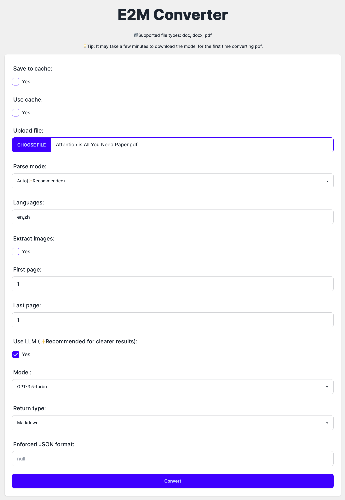

# E2M (Everything to Markdown)

<p align="center">
    <a href="https://github.com/Jing-yilin/E2M">
        
    </a>
</p>

<p align="center">
    <a href="https://github.com/Jing-yilin/E2M">
        
    </a>
    <a href="https://github.com/Jing-yilin/E2M/tags/v1.0.5">
        
    </a>
    <a href="https://hub.docker.com/r/jingyilin/e2m/tags">
        
    </a>
    <a href="https://github.com/Jing-yilin/E2M/blob/main/LICENSE">
        
    </a>
    <a href="https://www.python.org/downloads/">
        
    </a>
</p>

<div align="center">
  <a href="./README.md"></a>
  <a href="./README_CN.md"></a>
</div>

- [E2M (Everything to Markdown)](#e2m-everything-to-markdown)
  - [🌟 介绍](#-介绍)
    - [🌐 网页](#-网页)
    - [📸 演示](#-演示)
    - [📂 支持的文件类型](#-支持的文件类型)
  - [🚀 快速开始](#-快速开始)
    - [📦 快速开始（本地 Docker）](#-快速开始本地-docker)
    - [🎛️ 快速开始（支持 GPU）（本地 Docker）](#️-快速开始支持-gpu本地-docker)
      - [🐧Ubuntu](#ubuntu)
      - [🖥️Windows](#️windows)
    - [⚙️ 从源码开始](#️-从源码开始)
      - [🐧Ubuntu](#ubuntu-1)
      - [🍏Mac](#mac)
      - [🖥️Windows](#️windows-1)
    - [🔧 设置开发环境](#-设置开发环境)
    - [🏭 设置生产环境](#-设置生产环境)
    - [📖 如何使用](#-如何使用)
    - [语言支持](#语言支持)
  - [🤝 如何贡献](#-如何贡献)
    - [🌿 创建新分支](#-创建新分支)
    - [📝PEP8 风格](#pep8-风格)
    - [🔄 推送到远程仓库](#-推送到远程仓库)
    - [🐳 推送到 Docker](#-推送到-docker)
    - [🔀 拉取请求](#-拉取请求)
  - [🌟 贡献者](#-贡献者)
    - [👥 贡献者名单](#-贡献者名单)

## 🌟 介绍

这个项目旨在提供一个 API，可以将所有内容转换为 markdown（LLM 友好格式）。

### 🌐 网页



### 📸 演示


### 📂 支持的文件类型

<table style="width: 100%;">
  <tr>
    <th align="center">支持的类型</th>
    <th align="center">文档</th>
    <th align="center">图片</th>
    <th align="center">数据</th>
    <th align="center">音频</th>
    <th align="center">视频</th>
  </tr>
  <tr>
    <td align="center">完成</td>
    <td align="center">md, txt, doc, docx, pdf, py, json, yaml, yml</td>
    <td align="center"></td>
    <td align="center"></td>
    <td align="center"></td>
    <td align="center"></td>
  </tr>
  <tr>
    <td align="center">待完成</td>
    <td align="center">html, htm</td>
    <td align="center">jpg, jpeg, png, gif, svg</td>
    <td align="center">csv, xlsx, xls</td>
    <td align="center">mp3, wav, flac</td>
    <td align="center">mp4, avi, mkv</td>
  </tr>
</table>

## 🚀 快速开始

### 📦 快速开始（本地 Docker）

```bash
# 部署应用到 docker，分离模式
docker-compose up --build -d
# 查看日志
docker-compose logs -f
# 删除容器
docker-compose down
```

- 🚀 网页：[http://127.0.0.1:3000](http://127.0.0.1:3000)
- 🚀API：[http://127.0.0.1:8765/api/v1/](http://127.0.0.1:8765/api/v1/)
- 🚀API 文档：[http://127.0.0.1:8765/swagger/](http://127.0.0.1:8765/swagger/)

### 🎛️ 快速开始（支持 GPU）（本地 Docker）

#### 🐧Ubuntu

要利用本地 GPU，请按照以下步骤操作：

1. 安装 NVIDIA 驱动程序：确保在主机上安装了 NVIDIA 驱动程序。

2. 安装 NVIDIA 容器工具包：

```bash
distribution=$(. /etc/os-release;echo $ID$VERSION_ID)
curl -s -L https://nvidia.github.io/nvidia-docker/gpgkey | sudo apt-key add -
curl -s -L https://nvidia.github.io/nvidia-docker/$distribution/nvidia-docker.list | sudo tee /etc/apt/sources.list.d/nvidia-docker.list
sudo apt-get update
sudo apt-get install -y nvidia-docker2
sudo systemctl restart docker
```

> 如果遇到任何问题，可能需要更新 docker 版本。

1. 运行支持 GPU 的 Docker 容器：

```bash
docker-compose -f docker-compose.gpu.yml up --build -d
# 查看日志
docker-compose -f docker-compose.gpu.yml logs -f
# 删除容器
docker-compose -f docker-compose.gpu.yml down
```

- 🚀 网页：[http://127.0.0.1:3000](http://127.0.0.1:3000)
- 🚀API：[http://127.0.0.1:8765/api/v1/](http://127.0.0.1:8765/api/v1/)
- 🚀API 文档：[http://127.0.0.1:8765/swagger/](http://127.0.0.1:8765/swagger/)

#### 🖥️Windows

如果你使用 Windows，你可以使用 Docker Desktop 来支持 GPU：

> 安装gpu版docker请参考: [https://docs.docker.com/desktop/gpu/](https://docs.docker.com/desktop/gpu/)

然后，你可以使用以下命令启动容器：

```bash
docker-compose -f docker-compose.gpu.yml up --build -d
# check the logs with
docker-compose -f docker-compose.gpu.yml logs -f
# remove the container with
docker-compose -f docker-compose.gpu.yml down
```

### ⚙️ 从源码开始

安装：

```bash
git clone https://github.com/Jing-yilin/E2M
cd E2M/app
conda create -n e2m python=3.10 -y
conda activate e2m
python -m pip install -r requirements-dev.txt
```

首先，你应该安装 `postgresql@15.0` 和 `libreoffice`：

#### 🐧Ubuntu

1. 安装 PostgreSQL 15 和 LibreOffice：

    > 参考：[如何在 Ubuntu 上安装 PostgreSQL](https://www.linuxtechi.com/how-to-install-postgresql-on-ubuntu/)

    ```sh
    sudo sh -c 'echo "deb http://apt.postgresql.org/pub/repos/apt $(lsb_release -cs)-pgdg main" > /etc/apt/sources.list.d/pgdg.list'
    wget -qO- https://www.postgresql.org/media/keys/ACCC4CF8.asc | sudo tee /etc/apt/trusted.gpg.d/pgdg.asc &>/dev/null
    sudo apt update
    sudo apt install postgresql-15 postgresql-client-15 -y
    sudo apt install libreoffice -y
    ```

2. 启动 PostgreSQL：
    ```sh
    sudo systemctl status postgresql
    ```

#### 🍏Mac

1. 安装 PostgreSQL 15 和 LibreOffice：
    ```sh
    brew install postgresql@15 -y
    brew install --cask libreoffice -y
    ```
2. 启动 PostgreSQL：
    ```sh
    brew services start postgresql@15
    ```

#### 🖥️Windows

1. 安装 PostgreSQL 15 和 LibreOffice：

    ```sh
    choco install postgresql15 --version=15.0.1 -y
    choco install libreoffice -y
    ```

    _你可能需要以管理员身份运行 cmd_

    > 也可以从[这里](https://www.libreoffice.org/download/download/)下载 libreoffice

2. 启动 PostgreSQL：
    ```sh
    pg_ctl -D "C:\Program Files\PostgreSQL\15\data" start
    ```

然后，你需要迁移数据库：

> 你需要在 `setup_db.sh` 文件中更改 `DB_ADMIN` 和 `DB_PASSWORD`。

```bash
# 确保你在 E2M/app 目录
# 请将 DB_ADMIN 和 DB_PASSWORD 更改为你自己的设置
chmod +x ./setup_db.sh


./setup_db.sh
```

然后，你可以使用以下命令启动 API：

```bash
flask run --host 0.0.0.0 --port=8765 # --debug
```

如果你想要一个网页，可以使用以下命令启动网页：

```bash
cd web
npm install
npm run start
```

### 🔧 设置开发环境

```bash
export FLASK_ENV=development
export FLASK_DEBUG=1
```

### 🏭 设置生产环境

```bash
export FLASK_ENV=production
export FLASK_DEBUG=0
```

### 📖 如何使用

bash 脚本：

```bash
curl -X POST "http://127.0.0.1:8765/api/v1/convert" \
  -H "accept: application/json" \
  -H "Content-Type: multipart/form-data; charset=utf-8" \
  -H "Accept-Charset: utf-8" \
  -F "file=@/path/to/file.docx" \
  -F "parse_mode=auto"
```

返回：

```json
{
    "message": "这是你的 markdown 内容"
}
```

### 语言支持

```json
{
    "af": "南非荷兰语",
    "am": "阿姆哈拉语",
    "ar": "阿拉伯语",
    "as": "阿萨姆语",
    "az": "阿塞拜疆语",
    "be": "白俄罗斯语",
    "bg": "保加利亚语",
    "bn": "孟加拉语",
    "br": "布列塔尼语",
    "bs": "波斯尼亚语",
    "ca": "加泰罗尼亚语",
    "cs": "捷克语",
    "cy": "威尔士语",
    "da": "丹麦语",
    "de": "德语",
    "el": "希腊语",
    "en": "英语",
    "eo": "世界语",
    "es": "西班牙语",
    "et": "爱沙尼亚语",
    "eu": "巴斯克语",
    "fa": "波斯语",
    "fi": "芬兰语",
    "fr": "法语",
    "fy": "西弗里斯语",
    "ga": "爱尔兰语",
    "gd": "苏格兰盖尔语",
    "gl": "加利西亚语",
    "gu": "古吉拉特语",
    "ha": "豪萨语",
    "he": "希伯来语",
    "hi": "印地语",
    "hr": "克罗地亚语",
    "hu": "匈牙利语",
    "hy": "亚美尼亚语",
    "id": "印度尼西亚语",
    "is": "冰岛语",
    "it": "意大利语",
    "ja": "日语",
    "jv": "爪哇语",
    "ka": "格鲁吉亚语",
    "kk": "哈萨克语",
    "km": "高棉语",
    "kn": "卡纳达语",
    "ko": "韩语",
    "ku": "库尔德语",
    "ky": "吉尔吉斯语",
    "la": "拉丁语",
    "lo": "老挝语",
    "lt": "立陶宛语",
    "lv": "拉脱维亚语",
    "mg": "马达加斯加语",
    "mk": "马其顿语",
    "ml": "马拉雅拉姆语",
    "mn": "蒙古语",
    "mr": "马拉地语",
    "ms": "马来语",
    "my": "缅甸语",
    "ne": "尼泊尔语",
    "nl": "荷兰语",
    "no": "挪威语",
    "om": "奥罗莫语",
    "or": "奥里亚语",
    "pa": "旁遮普语",
    "pl": "波兰语",
    "ps": "普什图语",
    "pt": "葡萄牙语",
    "ro": "罗马尼亚语",
    "ru": "俄语",
    "sa": "梵语",
    "sd": "信德语",
    "si": "僧伽罗语",
    "sk": "斯洛伐克语",
    "sl": "斯洛文尼亚语",
    "so": "索马里语",
    "sq": "阿尔巴尼亚语",
    "sr": "塞尔维亚语",
    "su": "巽他语",
    "sv": "瑞典语",
    "sw": "斯瓦希里语",
    "ta": "泰米尔语",
    "te": "泰卢固语",
    "th": "泰语",
    "tl": "塔加洛语",
    "tr": "土耳其语",
    "ug": "维吾尔语",
    "uk": "乌克兰语",
    "ur": "乌尔都语",
    "uz": "乌兹别克语",
    "vi": "越南语",
    "xh": "科萨语",
    "yi": "意第绪语",
    "zh": "中文"
}
```

## 🤝 如何贡献

### 🌿 创建新分支

在提交代码之前，请创建一个新分支：

- `feature/xxx` 用于新功能
- `bugfix/xxx` 用于修复错误

你可以使用以下命令创建一个新分支：

```bash
# 获取最新代码
git checkout main
git pull
# 创建新分支
git checkout -b feature/xxx
```

### 📝PEP8 风格

然后，运行以下命令来格式化你的代码：

```bash
# 所有贡献都应遵循 PEP8 风格
flake8 .  # 检查代码风格
black .  # 格式化代码
pymarkdownlnt fix .  # 格式化 markdown
cd app
poetry export -f requirements.txt --without-hashes > requirements.txt
poetry export -f requirements.txt --without-hashes --with dev -o requirements-dev.txt
```

### 🔄 推送到远程仓库

```bash
# 添加更改
git add .
# 提交更改
git commit -m "你的提交信息"
# 推送更改
git push origin feature/xxx # 或者简单地 `git push`
```

### 🐳 推送到 Docker

新版本：

```
docker build -t jingyilin/e2m:<version> .
docker push jingyilin/e2m:<version>
```

例如，版本是 `v1.0.0`：

```
docker build -t jingyilin/e2m:v1.0.0 .
docker push jingyilin/e2m:v1.0.0
```

最新版本：

```
docker build -t jingyilin/e2m:latest .
docker push jingyilin/e2m:latest
```

### 🔀 拉取请求

```bash
# 在 GitHub 上创建一个到 develop 分支的拉取请求
```

## 🌟 贡献者

### 👥 贡献者名单

<a href="https://github.com/Jing-yilin/E2M/graphs/contributors">
  
</a>
