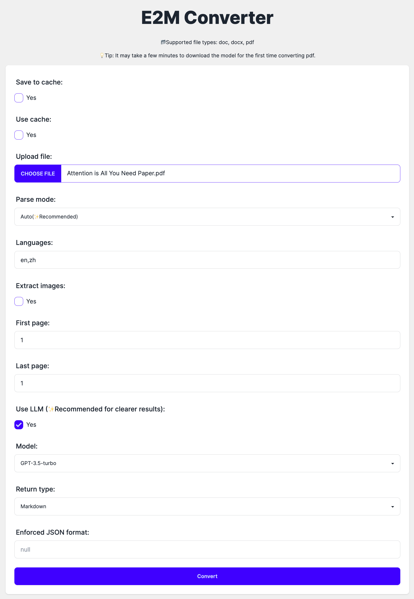
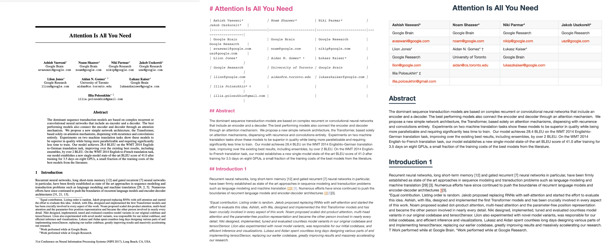
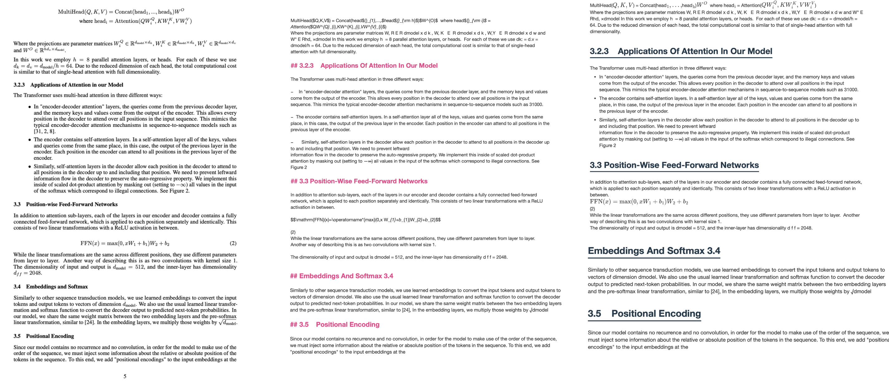
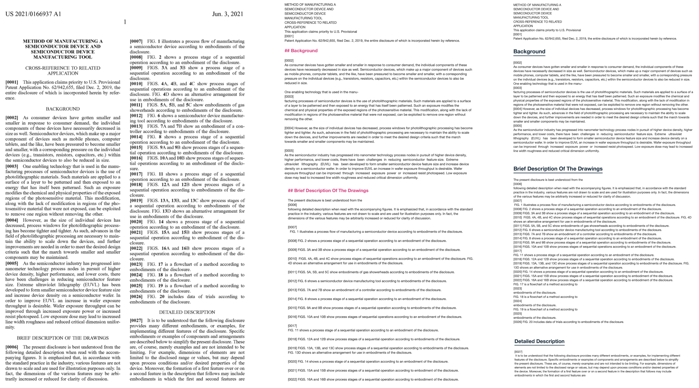

# E2M

    

# 🌟Introduction

✨Current version: `v1.1.3`

🦄E2M is an API tool converting everything to markdown or json(both LLM-friendly Format).

🔥You'd better set `USE_LLM=True` and use a LLM API to get the best result.

> Why do I create this API? Because I do believe data is the most important thing in this AI era, but many resources are not in the right format. **They are only information, not data.** So I want to create a tool to convert everything to markdown or json, which is the most common format in the AI field. I hope E2M can be used in any AI application that needs format conversion, such as AI knowledge base, AI dataset, etc., so that developers can focus on the core functions of AI applications, not data format conversion.

## 🌐Web

    

## 📸Demo

    

    

    

## 📂Supported File Types

<table style="width: 100%;">
  <tr>
    <th align="center">Supported</th>
    <th align="center">Document</th>
    <th align="center">Image</th>
    <th align="center">Data</th>
    <th align="center">Audio</th>
    <th align="center">Video</th>
  </tr>
  <tr>
    <td align="center">Done</td>
    <td align="center">doc, docx, ppt, pptx, pdf, html, htm</td>
    <td align="center"></td>
    <td align="center"></td>
    <td align="center"></td>
    <td align="center"></td>
  </tr>
  <tr>
    <td align="center">Todo</td>
    <td align="center"></td>
    <td align="center">jpg, jpeg, png, gif, svg</td>
    <td align="center">csv, xlsx, xls</td>
    <td align="center">mp3, wav, flac</td>
    <td align="center">mp4, avi, mkv</td>
  </tr>
</table>
